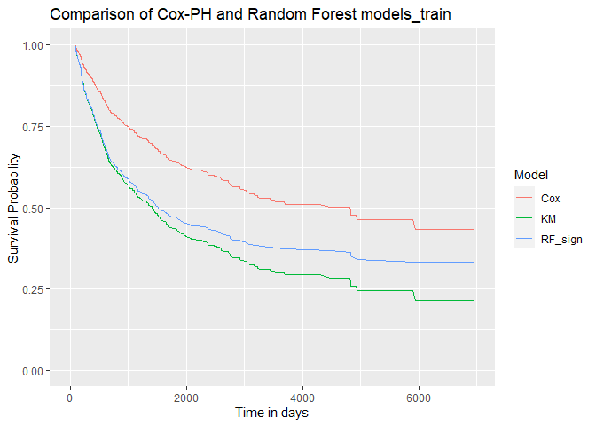

# Data

``` r
library(dplyr)
library(tidyverse)
dat_train <-
  readxl::read_xlsx("RevisedData/imputed_data_train.xlsx") %>%
  filter(DaysToRecurrence >= 90) %>% # only +90 values in the duration column
  select(-c(Hospital, MRN, DOB)) %>%
  # renaming the columns to avoid very long names
  rename(
    LiverDisease = UnderlyingLiverDisease_NASH_0_HepB_1_HepC_2_Alcohol_3_Other_4_,
    NAFLD = NAFLDVsNonNAFLD,
    Viral = ViralVs0nviral,
    Age = AgeAtResection_years_,
    Size = sizeOfLargestLesion_cm_,
    Sex = SexCodedM_0_F_1,
    Ethnicity = Ethnicity_0Aus_1Asian_2African3European4Other_,
    LVI = Lymphatic_vascularInvasion,
    PortalHTN = PortalHTN_HPVG_5mmhg_,
    HBsAg = HBsAgPositive,
    HepC = ChronicHepatitisC,
    TreatDiabetes = DiabetesTreatmentPriorToResectionY1N0,
    TreatHTN = TreatmentOfHTNPriorToResectionY1N0
  ) %>%
  select(-c(NAFLD, Viral, HBsAg, HepC, TreatDiabetes, TreatHTN))

dat_test <-
  readxl::read_xlsx("RevisedData/binarized_data_test.xlsx") %>%
  filter(DaysToRecurrence >= 90) %>% # only +90 values in the duration column
  select(-c(Hospital, MRN, DOB)) %>%
  # renaming the columns to avoid very long names
  rename(
    LiverDisease = UnderlyingLiverDisease_NASH_0_HepB_1_HepC_2_Alcohol_3_Other_4_,
    NAFLD = NAFLDVsNonNAFLD,
    Viral = ViralVs0nviral,
    Age = AgeAtResection_years_,
    Size = sizeOfLargestLesion_cm_,
    Sex = SexCodedM_0_F_1,
    Ethnicity = Ethnicity_0Aus_1Asian_2African3European4Other_,
    LVI = Lymphatic_vascularInvasion,
    PortalHTN = PortalHTN_HPVG_5mmhg_,
    HBsAg = HBsAgPositive,
    HepC = ChronicHepatitisC,
    TreatDiabetes = DiabetesTreatmentPriorToResectionY1N0,
    TreatHTN = TreatmentOfHTNPriorToResectionY1N0
  ) %>%
  select(-c(NAFLD, Viral, HBsAg, HepC, TreatDiabetes, TreatHTN))

dat_train[, 3:ncol(dat_train)] <-
  lapply(dat_train[3:ncol(dat_train)], factor) ## as.factor() could also be used
dat_test[, 3:ncol(dat_train)] <-
  lapply(dat_test[3:ncol(dat_train)], factor) ## as.factor() could also be used
```

# Modelling

## Kaplan Meier Analysis

``` r
library(survival)
library(ggplot2)
library(survminer)

dat_train_yr <-
  dat_train %>% mutate(YearsToRecurrence = DaysToRecurrence / 365.25)
km_fit <-
  survfit(Surv(YearsToRecurrence, Recurrence) ~ 1, data = dat_train_yr)

# pdf("KM-0.pdf", width = 6, height = 6)
ggsurvplot(
  km_fit,
  data = dat_train_yr,
  xlab = "Time in years",
  xlim = c(0, 20),
  ylim = c(0, 1),
  conf.int = TRUE,
  # Add confidence interval
  risk.table = TRUE,
  # Add risk table
  ggtheme = theme_bw() # Change ggplot2 theme
)
```


``` r
# dev.off()
```

## Kaplan Meier Analysis with group

``` r
# ---------------------------------------------------------------------------------------#
# LiverDesease
km_trt_fit <- survfit(
  Surv(YearsToRecurrence, Recurrence) ~
    LiverDisease,
  data = dat_train_yr
)

# pdf("KM_LiverDisease.pdf", width = 6, height = 6)
ggsurvplot(
  km_trt_fit,
  data = dat_train_yr,
  size = 1,
  # change line size
  conf.int = TRUE,
  # Add confidence interval
  pval = TRUE,
  # Add p-value
  risk.table = TRUE,
  # Add risk table
  risk.table.col = "strata",
  # Risk table color by groups
  title = "Underlying liver disease",
  xlab = "Time in years",
  xlim = c(0, 20),
  ylim = c(0, 1),
  legend.labs =
    c("NASH", "HepB", "HepC", "Alcohol", "Other"),
  # Change legend labels
  risk.table.height = 0.3,
  # Useful to change when you have multiple groups
  ggtheme = theme_bw() # Change ggplot2 theme
)
```


``` r
# dev.off()

# ---------------------------------------------------------------------------------------#
# Age
km_trt_fit <- survfit(
  Surv(YearsToRecurrence, Recurrence) ~
    Age,
  data = dat_train_yr
)

# pdf("KM_Age.pdf", width = 6, height = 6)
ggsurvplot(
  km_trt_fit,
  data = dat_train_yr,
  size = 1,
  # change line size
  conf.int = TRUE,
  # Add confidence interval
  pval = TRUE,
  # Add p-value
  risk.table = TRUE,
  # Add risk table
  risk.table.col = "strata",
  # Risk table color by groups
  title = "Age 65 years",
  xlab = "Time in years",
  xlim = c(0, 20),
  ylim = c(0, 1),
  risk.table.height = 0.3,
  # Useful to change when you have multiple groups
  ggtheme = theme_bw() # Change ggplot2 theme
)
```


``` r
# dev.off()

# ---------------------------------------------------------------------------------------#
# PriorTACE
km_trt_fit <- survfit(
  Surv(YearsToRecurrence, Recurrence) ~
    PriorTACE,
  data = dat_train_yr
)

# pdf("KM_PriorTACE.pdf", width = 6, height = 6)
ggsurvplot(
  km_trt_fit,
  data = dat_train_yr,
  size = 1,
  # change line size
  conf.int = TRUE,
  # Add confidence interval
  pval = TRUE,
  # Add p-value
  risk.table = TRUE,
  # Add risk table
  risk.table.col = "strata",
  # Risk table color by groups
  title = "Prior TACE",
  xlab = "Time in years",
  xlim = c(0, 20),
  ylim = c(0, 1),
  risk.table.height = 0.3,
  # Useful to change when you have multiple groups
  ggtheme = theme_bw() # Change ggplot2 theme
)
```


``` r
# dev.off()

# ---------------------------------------------------------------------------------------#
# bili
km_trt_fit <- survfit(
  Surv(YearsToRecurrence, Recurrence) ~
    bili,
  data = dat_train_yr
)

# pdf("KM_bili.pdf", width = 6, height = 6)
ggsurvplot(
  km_trt_fit,
  data = dat_train_yr,
  size = 1,
  # change line size
  conf.int = TRUE,
  # Add confidence interval
  pval = TRUE,
  # Add p-value
  risk.table = TRUE,
  # Add risk table
  risk.table.col = "strata",
  # Risk table color by groups
  title = "Bilirubin",
  xlab = "Time in years",
  xlim = c(0, 20),
  ylim = c(0, 1),
  risk.table.height = 0.3,
  # Useful to change when you have multiple groups
  ggtheme = theme_bw() # Change ggplot2 theme
)
```


``` r
# dev.off()

# ---------------------------------------------------------------------------------------#
# albumin
km_trt_fit <- survfit(
  Surv(YearsToRecurrence, Recurrence) ~
    albumin,
  data = dat_train_yr
)

# pdf("KM_albumin.pdf", width = 6, height = 6)
ggsurvplot(
  km_trt_fit,
  data = dat_train_yr,
  size = 1,
  # change line size
  conf.int = TRUE,
  # Add confidence interval
  pval = TRUE,
  # Add p-value
  risk.table = TRUE,
  # Add risk table
  risk.table.col = "strata",
  # Risk table color by groups
  title = "Albumin",
  xlab = "Time in years",
  xlim = c(0, 20),
  ylim = c(0, 1),
  risk.table.height = 0.3,
  # Useful to change when you have multiple groups
  ggtheme = theme_bw() # Change ggplot2 theme
)
```


``` r
# dev.off()

# ---------------------------------------------------------------------------------------#
# INR
km_trt_fit <- survfit(
  Surv(YearsToRecurrence, Recurrence) ~
    INR,
  data = dat_train_yr
)

# pdf("KM_INR.pdf", width = 6, height = 6)
ggsurvplot(
  km_trt_fit,
  data = dat_train_yr,
  size = 1,
  # change line size
  conf.int = TRUE,
  # Add confidence interval
  pval = TRUE,
  # Add p-value
  risk.table = TRUE,
  # Add risk table
  risk.table.col = "strata",
  # Risk table color by groups
  title = "INR",
  xlab = "Time in years",
  xlim = c(0, 20),
  ylim = c(0, 1),
  risk.table.height = 0.3,
  # Useful to change when you have multiple groups
  ggtheme = theme_bw() # Change ggplot2 theme
)
```


``` r
# dev.off()

# ---------------------------------------------------------------------------------------#
# PlateletCount
km_trt_fit <- survfit(
  Surv(YearsToRecurrence, Recurrence) ~
    PlateletCount,
  data = dat_train_yr
)

# pdf("KM_PlateletCount.pdf", width = 6, height = 6)
ggsurvplot(
  km_trt_fit,
  data = dat_train_yr,
  size = 1,
  # change line size
  conf.int = TRUE,
  # Add confidence interval
  pval = TRUE,
  # Add p-value
  risk.table = TRUE,
  # Add risk table
  risk.table.col = "strata",
  # Risk table color by groups
  title = "Platelet count",
  xlab = "Time in years",
  xlim = c(0, 20),
  ylim = c(0, 1),
  risk.table.height = 0.3,
  # Useful to change when you have multiple groups
  ggtheme = theme_bw() # Change ggplot2 theme
)
```


``` r
# dev.off()

# ---------------------------------------------------------------------------------------#
# AFP
km_trt_fit <- survfit(
  Surv(YearsToRecurrence, Recurrence) ~
    AFP,
  data = dat_train_yr
)

# pdf("KM_AFP.pdf", width = 6, height = 6)
ggsurvplot(
  km_trt_fit,
  data = dat_train_yr,
  size = 1,
  # change line size
  conf.int = TRUE,
  # Add confidence interval
  pval = TRUE,
  # Add p-value
  risk.table = TRUE,
  # Add risk table
  risk.table.col = "strata",
  # Risk table color by groups
  title = "AFP",
  xlab = "Time in years",
  xlim = c(0, 20),
  ylim = c(0, 1),
  risk.table.height = 0.3,
  # Useful to change when you have multiple groups
  ggtheme = theme_bw() # Change ggplot2 theme
)
```


``` r
# dev.off()

# ---------------------------------------------------------------------------------------#
# numberOfLesions
km_trt_fit <- survfit(
  Surv(YearsToRecurrence, Recurrence) ~
    numberOfLesions,
  data = dat_train_yr
)

# pdf("KM_numberOfLesions.pdf", width = 6, height = 6)
ggsurvplot(
  km_trt_fit,
  data = dat_train_yr,
  size = 1,
  # change line size
  conf.int = TRUE,
  # Add confidence interval
  pval = TRUE,
  # Add p-value
  risk.table = TRUE,
  # Add risk table
  risk.table.col = "strata",
  # Risk table color by groups
  title = "Number of lesions > 1",
  xlab = "Time in years",
  xlim = c(0, 20),
  ylim = c(0, 1),
  risk.table.height = 0.3,
  # Useful to change when you have multiple groups
  ggtheme = theme_bw() # Change ggplot2 theme
)
```


``` r
# dev.off()

# ---------------------------------------------------------------------------------------#
# Size
km_trt_fit <- survfit(
  Surv(YearsToRecurrence, Recurrence) ~
    Size,
  data = dat_train_yr
)

# pdf("KM_Size.pdf", width = 6, height = 6)
ggsurvplot(
  km_trt_fit,
  data = dat_train_yr,
  size = 1,
  # change line size
  conf.int = TRUE,
  # Add confidence interval
  pval = TRUE,
  # Add p-value
  risk.table = TRUE,
  # Add risk table
  risk.table.col = "strata",
  # Risk table color by groups
  title = "Size of the largest lesion >= 5cm",
  xlab = "Time in years",
  xlim = c(0, 20),
  ylim = c(0, 1),
  risk.table.height = 0.3,
  # Useful to change when you have multiple groups
  ggtheme = theme_bw() # Change ggplot2 theme
)
```


``` r
# dev.off()

# ---------------------------------------------------------------------------------------#
# satellite
km_trt_fit <- survfit(
  Surv(YearsToRecurrence, Recurrence) ~
    satellite,
  data = dat_train_yr
)

# pdf("KM_satellite.pdf", width = 6, height = 6)
ggsurvplot(
  km_trt_fit,
  data = dat_train_yr,
  size = 1,
  # change line size
  conf.int = TRUE,
  # Add confidence interval
  pval = TRUE,
  # Add p-value
  risk.table = TRUE,
  # Add risk table
  risk.table.col = "strata",
  # Risk table color by groups
  title = "Satellite lesions",
  xlab = "Time in years",
  xlim = c(0, 20),
  ylim = c(0, 1),
  risk.table.height = 0.3,
  # Useful to change when you have multiple groups
  ggtheme = theme_bw() # Change ggplot2 theme
)
```


``` r
# dev.off()

# ---------------------------------------------------------------------------------------#
# cirrhosis
km_trt_fit <- survfit(
  Surv(YearsToRecurrence, Recurrence) ~
    cirrhosis,
  data = dat_train_yr
)
# pdf("KM_cirrhosis.pdf", width = 6, height = 6)
ggsurvplot(
  km_trt_fit,
  data = dat_train_yr,
  size = 1,
  # change line size
  conf.int = TRUE,
  # Add confidence interval
  pval = TRUE,
  # Add p-value
  risk.table = TRUE,
  # Add risk table
  risk.table.col = "strata",
  # Risk table color by groups
  title = "Cirrhosis",
  xlab = "Time in years",
  xlim = c(0, 20),
  ylim = c(0, 1),
  risk.table.height = 0.3,
  # Useful to change when you have multiple groups
  ggtheme = theme_bw() # Change ggplot2 theme
)
```


``` r
# dev.off()

# ---------------------------------------------------------------------------------------#
# Sex
km_trt_fit <- survfit(
  Surv(YearsToRecurrence, Recurrence) ~
    Sex,
  data = dat_train_yr
)

# pdf("KM_Sex.pdf", width = 6, height = 6)
ggsurvplot(
  km_trt_fit,
  data = dat_train_yr,
  size = 1,
  # change line size
  conf.int = TRUE,
  # Add confidence interval
  pval = TRUE,
  # Add p-value
  risk.table = TRUE,
  # Add risk table
  risk.table.col = "strata",
  # Risk table color by groups
  title = "Gender",
  xlab = "Time in years",
  xlim = c(0, 20),
  ylim = c(0, 1),
  legend.labs =
    c("Female", "Male"),
  # Change legend labels
  risk.table.height = 0.3,
  # Useful to change when you have multiple groups
  ggtheme = theme_bw() # Change ggplot2 theme
)
```


``` r
# dev.off()

# ---------------------------------------------------------------------------------------#
# Ethnicity
km_trt_fit <- survfit(
  Surv(YearsToRecurrence, Recurrence) ~
    Ethnicity,
  data = dat_train_yr
)

# pdf("KM_Ethnicity.pdf", width = 6, height = 6)
ggsurvplot(
  km_trt_fit,
  data = dat_train_yr,
  size = 1,
  # change line size
  conf.int = TRUE,
  # Add confidence interval
  pval = TRUE,
  # Add p-value
  risk.table = TRUE,
  # Add risk table
  risk.table.col = "strata",
  # Risk table color by groups
  title = "Ethnicity",
  xlab = "Time in years",
  xlim = c(0, 20),
  ylim = c(0, 1),
  legend.labs =
    c("Caucasian", "Asian", "Others"),
  # Change legend labels
  risk.table.height = 0.3,
  # Useful to change when you have multiple groups
  ggtheme = theme_bw() # Change ggplot2 theme
)
```


``` r
# dev.off()

# ---------------------------------------------------------------------------------------#
# LVI
km_trt_fit <- survfit(
  Surv(YearsToRecurrence, Recurrence) ~
    LVI,
  data = dat_train_yr
)

# pdf("KM_LVI.pdf", width = 6, height = 6)
ggsurvplot(
  km_trt_fit,
  data = dat_train_yr,
  size = 1,
  # change line size
  conf.int = TRUE,
  # Add confidence interval
  pval = TRUE,
  # Add p-value
  risk.table = TRUE,
  # Add risk table
  risk.table.col = "strata",
  # Risk table color by groups
  title = "Lymphatic vascular invasion",
  xlab = "Time in years",
  xlim = c(0, 20),
  ylim = c(0, 1),
  risk.table.height = 0.3,
  # Useful to change when you have multiple groups
  ggtheme = theme_bw() # Change ggplot2 theme
)
```


``` r
# dev.off()

# ---------------------------------------------------------------------------------------#
# PortalHTN
km_trt_fit <- survfit(
  Surv(YearsToRecurrence, Recurrence) ~
    PortalHTN,
  data = dat_train_yr
)

# pdf("KM_PortalHTN.pdf", width = 6, height = 6)
ggsurvplot(
  km_trt_fit,
  data = dat_train_yr,
  size = 1,
  # change line size
  conf.int = TRUE,
  # Add confidence interval
  pval = TRUE,
  # Add p-value
  risk.table = TRUE,
  # Add risk table
  risk.table.col = "strata",
  # Risk table color by groups
  title = "Portal HTN HPVG 5mmhg",
  xlab = "Time in years",
  xlim = c(0, 20),
  ylim = c(0, 1),
  risk.table.height = 0.3,
  # Useful to change when you have multiple groups
  ggtheme = theme_bw() # Change ggplot2 theme
)
```


``` r
# dev.off()

# ---------------------------------------------------------------------------------------#
# ALT
km_trt_fit <- survfit(
  Surv(YearsToRecurrence, Recurrence) ~
    ALT,
  data = dat_train_yr
)

# pdf("KM_ALT.pdf", width = 6, height = 6)
ggsurvplot(
  km_trt_fit,
  data = dat_train_yr,
  size = 1,
  # change line size
  conf.int = TRUE,
  # Add confidence interval
  pval = TRUE,
  # Add p-value
  risk.table = TRUE,
  # Add risk table
  risk.table.col = "strata",
  # Risk table color by groups
  title = "ALT",
  xlab = "Time in years",
  xlim = c(0, 20),
  ylim = c(0, 1),
  risk.table.height = 0.3,
  # Useful to change when you have multiple groups
  ggtheme = theme_bw() # Change ggplot2 theme
)
```


``` r
# dev.off()

# ---------------------------------------------------------------------------------------#
# BMI
km_trt_fit <- survfit(
  Surv(YearsToRecurrence, Recurrence) ~
    BMI,
  data = dat_train_yr
)

# pdf("KM_BMI.pdf", width = 6, height = 6)
ggsurvplot(
  km_trt_fit,
  data = dat_train_yr,
  size = 1,
  # change line size
  conf.int = TRUE,
  # Add confidence interval
  pval = TRUE,
  # Add p-value
  risk.table = TRUE,
  # Add risk table
  risk.table.col = "strata",
  # Risk table color by groups
  title = "BMI",
  xlab = "Time in years",
  xlim = c(0, 20),
  ylim = c(0, 1),
  risk.table.height = 0.3,
  # Useful to change when you have multiple groups
  ggtheme = theme_bw() # Change ggplot2 theme
)
```


``` r
# dev.off()

# ---------------------------------------------------------------------------------------#
# DM
km_trt_fit <- survfit(
  Surv(YearsToRecurrence, Recurrence) ~
    DM,
  data = dat_train_yr
)

# pdf("KM_DM.pdf", width = 6, height = 6)
ggsurvplot(
  km_trt_fit,
  data = dat_train_yr,
  size = 1,
  # change line size
  conf.int = TRUE,
  # Add confidence interval
  pval = TRUE,
  # Add p-value
  risk.table = TRUE,
  # Add risk table
  risk.table.col = "strata",
  # Risk table color by groups
  title = "DM",
  xlab = "Time in years",
  xlim = c(0, 20),
  ylim = c(0, 1),
  risk.table.height = 0.3,
  # Useful to change when you have multiple groups
  ggtheme = theme_bw() # Change ggplot2 theme
)
```


``` r
# dev.off()

# ---------------------------------------------------------------------------------------#
# Hypertension
km_trt_fit <- survfit(
  Surv(YearsToRecurrence, Recurrence) ~
    Hypertension,
  data = dat_train_yr
)

# pdf("KM_Hypertension.pdf", width = 6, height = 6)
ggsurvplot(
  km_trt_fit,
  data = dat_train_yr,
  size = 1,
  # change line size
  conf.int = TRUE,
  # Add confidence interval
  pval = TRUE,
  # Add p-value
  risk.table = TRUE,
  # Add risk table
  risk.table.col = "strata",
  # Risk table color by groups
  title = "Hypertension",
  xlab = "Time in years",
  xlim = c(0, 20),
  ylim = c(0, 1),
  risk.table.height = 0.3,
  # Useful to change when you have multiple groups
  ggtheme = theme_bw() # Change ggplot2 theme
)
```


``` r
# dev.off()

# ---------------------------------------------------------------------------------------#
# eGFR
km_trt_fit <- survfit(
  Surv(YearsToRecurrence, Recurrence) ~
    eGFR,
  data = dat_train_yr
)

# pdf("KM_eGFR.pdf", width = 6, height = 6)
ggsurvplot(
  km_trt_fit,
  data = dat_train_yr,
  size = 1,
  # change line size
  conf.int = TRUE,
  # Add confidence interval
  pval = TRUE,
  # Add p-value
  risk.table = TRUE,
  # Add risk table
  risk.table.col = "strata",
  # Risk table color by groups
  title = "eGFR",
  xlab = "Time in years",
  xlim = c(0, 20),
  ylim = c(0, 1),
  risk.table.height = 0.3,
  # Useful to change when you have multiple groups
  ggtheme = theme_bw() # Change ggplot2 theme
)
```


``` r
# dev.off()

# ---------------------------------------------------------------------------------------#
# IHD
km_trt_fit <- survfit(
  Surv(YearsToRecurrence, Recurrence) ~
    IHD,
  data = dat_train_yr
)

# pdf("KM_IHD.pdf", width = 6, height = 6)
ggsurvplot(
  km_trt_fit,
  data = dat_train_yr,
  size = 1,
  # change line size
  conf.int = TRUE,
  # Add confidence interval
  pval = TRUE,
  # Add p-value
  risk.table = TRUE,
  # Add risk table
  risk.table.col = "strata",
  # Risk table color by groups
  title = "IHD",
  xlab = "Time in years",
  xlim = c(0, 20),
  ylim = c(0, 1),
  risk.table.height = 0.3,
  # Useful to change when you have multiple groups
  ggtheme = theme_bw() # Change ggplot2 theme
)
```


``` r
# dev.off()

# ---------------------------------------------------------------------------------------#
# CVS
km_trt_fit <- survfit(
  Surv(YearsToRecurrence, Recurrence) ~
    CVS,
  data = dat_train_yr
)

# pdf("KM_CVS.pdf", width = 6, height = 6)
ggsurvplot(
  km_trt_fit,
  data = dat_train_yr,
  size = 1,
  # change line size
  conf.int = TRUE,
  # Add confidence interval
  pval = TRUE,
  # Add p-value
  risk.table = TRUE,
  # Add risk table
  risk.table.col = "strata",
  # Risk table color by groups
  title = "CVS",
  xlab = "Time in years",
  xlim = c(0, 20),
  ylim = c(0, 1),
  risk.table.height = 0.3,
  # Useful to change when you have multiple groups
  ggtheme = theme_bw() # Change ggplot2 theme
)
```


``` r
# dev.off()
```

## Semi-parametric Cox-PH Model

### Fit univariate Cox Model

``` r
library(forestmodel)
covariates <- colnames(dat_train)[3:ncol(dat_train)]

univ_formulas <-
  sapply(covariates, function(x) {
    as.formula(paste("Surv(DaysToRecurrence, Recurrence)~", x))
  })

univ_models <- lapply(univ_formulas, function(x) {
  coxph(x, data = dat_train)
})
lapply(univ_models, function(x) {
  summary(x)
})
```

    ## $LiverDisease
    ## Call:
    ## coxph(formula = x, data = dat_train)
    ## 
    ##   n= 652, number of events= 376 
    ## 
    ##                   coef exp(coef) se(coef)      z Pr(>|z|)  
    ## LiverDisease1 -0.35716   0.69966  0.19827 -1.801   0.0716 .
    ## LiverDisease2  0.06321   1.06525  0.22394  0.282   0.7777  
    ## LiverDisease3  0.04396   1.04494  0.27298  0.161   0.8721  
    ## LiverDisease4 -0.17573   0.83884  0.29160 -0.603   0.5467  
    ## ---
    ## Signif. codes:  0 '***' 0.001 '**' 0.01 '*' 0.05 '.' 0.1 ' ' 1
    ## 
    ##               exp(coef) exp(-coef) lower .95 upper .95
    ## LiverDisease1    0.6997     1.4293    0.4744     1.032
    ## LiverDisease2    1.0652     0.9387    0.6868     1.652
    ## LiverDisease3    1.0449     0.9570    0.6120     1.784
    ## LiverDisease4    0.8388     1.1921    0.4737     1.486
    ## 
    ## Concordance= 0.528  (se = 0.013 )
    ## Likelihood ratio test= 11.75  on 4 df,   p=0.02
    ## Wald test            = 12.26  on 4 df,   p=0.02
    ## Score (logrank) test = 12.41  on 4 df,   p=0.01
    ## 
    ## 
    ## $Age
    ## Call:
    ## coxph(formula = x, data = dat_train)
    ## 
    ##   n= 652, number of events= 376 
    ## 
    ##       coef exp(coef) se(coef)     z Pr(>|z|)
    ## Age1 0.175     1.191    0.113 1.549    0.121
    ## 
    ##      exp(coef) exp(-coef) lower .95 upper .95
    ## Age1     1.191     0.8394    0.9546     1.487
    ## 
    ## Concordance= 0.502  (se = 0.012 )
    ## Likelihood ratio test= 2.35  on 1 df,   p=0.1
    ## Wald test            = 2.4  on 1 df,   p=0.1
    ## Score (logrank) test = 2.4  on 1 df,   p=0.1
    ## 
    ## 
    ## $PriorTACE
    ## Call:
    ## coxph(formula = x, data = dat_train)
    ## 
    ##   n= 652, number of events= 376 
    ## 
    ##               coef exp(coef) se(coef)      z Pr(>|z|)
    ## PriorTACE1 -0.1320    0.8763   0.1849 -0.714    0.475
    ## 
    ##            exp(coef) exp(-coef) lower .95 upper .95
    ## PriorTACE1    0.8763      1.141      0.61     1.259
    ## 
    ## Concordance= 0.502  (se = 0.008 )
    ## Likelihood ratio test= 0.53  on 1 df,   p=0.5
    ## Wald test            = 0.51  on 1 df,   p=0.5
    ## Score (logrank) test = 0.51  on 1 df,   p=0.5
    ## 
    ## 
    ## $bili
    ## Call:
    ## coxph(formula = x, data = dat_train)
    ## 
    ##   n= 652, number of events= 376 
    ## 
    ##         coef exp(coef) se(coef)    z Pr(>|z|)  
    ## bili1 0.3937    1.4824   0.1675 2.35   0.0188 *
    ## ---
    ## Signif. codes:  0 '***' 0.001 '**' 0.01 '*' 0.05 '.' 0.1 ' ' 1
    ## 
    ##       exp(coef) exp(-coef) lower .95 upper .95
    ## bili1     1.482     0.6746     1.067     2.059
    ## 
    ## Concordance= 0.519  (se = 0.008 )
    ## Likelihood ratio test= 4.98  on 1 df,   p=0.03
    ## Wald test            = 5.52  on 1 df,   p=0.02
    ## Score (logrank) test = 5.59  on 1 df,   p=0.02
    ## 
    ## 
    ## $albumin
    ## Call:
    ## coxph(formula = x, data = dat_train)
    ## 
    ##   n= 652, number of events= 376 
    ## 
    ##            coef exp(coef) se(coef)     z Pr(>|z|)    
    ## albumin1 0.5849    1.7949   0.1392 4.203 2.64e-05 ***
    ## ---
    ## Signif. codes:  0 '***' 0.001 '**' 0.01 '*' 0.05 '.' 0.1 ' ' 1
    ## 
    ##          exp(coef) exp(-coef) lower .95 upper .95
    ## albumin1     1.795     0.5571     1.366     2.358
    ## 
    ## Concordance= 0.538  (se = 0.01 )
    ## Likelihood ratio test= 15.54  on 1 df,   p=8e-05
    ## Wald test            = 17.66  on 1 df,   p=3e-05
    ## Score (logrank) test = 18.17  on 1 df,   p=2e-05
    ## 
    ## 
    ## $INR
    ## Call:
    ## coxph(formula = x, data = dat_train)
    ## 
    ##   n= 652, number of events= 376 
    ## 
    ##        coef exp(coef) se(coef)     z Pr(>|z|)    
    ## INR1 0.5615    1.7533   0.1110 5.056 4.27e-07 ***
    ## ---
    ## Signif. codes:  0 '***' 0.001 '**' 0.01 '*' 0.05 '.' 0.1 ' ' 1
    ## 
    ##      exp(coef) exp(-coef) lower .95 upper .95
    ## INR1     1.753     0.5704      1.41      2.18
    ## 
    ## Concordance= 0.552  (se = 0.012 )
    ## Likelihood ratio test= 23.7  on 1 df,   p=1e-06
    ## Wald test            = 25.57  on 1 df,   p=4e-07
    ## Score (logrank) test = 26.24  on 1 df,   p=3e-07
    ## 
    ## 
    ## $PlateletCount
    ## Call:
    ## coxph(formula = x, data = dat_train)
    ## 
    ##   n= 652, number of events= 376 
    ## 
    ##                  coef exp(coef) se(coef)     z Pr(>|z|)   
    ## PlateletCount1 0.2917    1.3387   0.1049 2.779  0.00545 **
    ## ---
    ## Signif. codes:  0 '***' 0.001 '**' 0.01 '*' 0.05 '.' 0.1 ' ' 1
    ## 
    ##                exp(coef) exp(-coef) lower .95 upper .95
    ## PlateletCount1     1.339      0.747      1.09     1.644
    ## 
    ## Concordance= 0.529  (se = 0.013 )
    ## Likelihood ratio test= 7.57  on 1 df,   p=0.006
    ## Wald test            = 7.73  on 1 df,   p=0.005
    ## Score (logrank) test = 7.78  on 1 df,   p=0.005
    ## 
    ## 
    ## $AFP
    ## Call:
    ## coxph(formula = x, data = dat_train)
    ## 
    ##   n= 652, number of events= 376 
    ## 
    ##        coef exp(coef) se(coef)     z Pr(>|z|)  
    ## AFP1 0.1937    1.2138   0.1248 1.552    0.121  
    ## AFP2 0.2253    1.2527   0.1248 1.805    0.071 .
    ## ---
    ## Signif. codes:  0 '***' 0.001 '**' 0.01 '*' 0.05 '.' 0.1 ' ' 1
    ## 
    ##      exp(coef) exp(-coef) lower .95 upper .95
    ## AFP1     1.214     0.8239    0.9504      1.55
    ## AFP2     1.253     0.7983    0.9809      1.60
    ## 
    ## Concordance= 0.563  (se = 0.015 )
    ## Likelihood ratio test= 4.09  on 2 df,   p=0.1
    ## Wald test            = 4.06  on 2 df,   p=0.1
    ## Score (logrank) test = 4.08  on 2 df,   p=0.1
    ## 
    ## 
    ## $numberOfLesions
    ## Call:
    ## coxph(formula = x, data = dat_train)
    ## 
    ##   n= 652, number of events= 376 
    ## 
    ##                    coef exp(coef) se(coef)     z Pr(>|z|)    
    ## numberOfLesions1 0.5339    1.7056   0.1229 4.343  1.4e-05 ***
    ## ---
    ## Signif. codes:  0 '***' 0.001 '**' 0.01 '*' 0.05 '.' 0.1 ' ' 1
    ## 
    ##                  exp(coef) exp(-coef) lower .95 upper .95
    ## numberOfLesions1     1.706     0.5863      1.34      2.17
    ## 
    ## Concordance= 0.555  (se = 0.012 )
    ## Likelihood ratio test= 17.05  on 1 df,   p=4e-05
    ## Wald test            = 18.86  on 1 df,   p=1e-05
    ## Score (logrank) test = 19.31  on 1 df,   p=1e-05
    ## 
    ## 
    ## $Size
    ## Call:
    ## coxph(formula = x, data = dat_train)
    ## 
    ##   n= 652, number of events= 376 
    ## 
    ##         coef exp(coef) se(coef)     z Pr(>|z|)  
    ## Size1 0.2193    1.2453   0.1105 1.984   0.0472 *
    ## ---
    ## Signif. codes:  0 '***' 0.001 '**' 0.01 '*' 0.05 '.' 0.1 ' ' 1
    ## 
    ##       exp(coef) exp(-coef) lower .95 upper .95
    ## Size1     1.245      0.803     1.003     1.546
    ## 
    ## Concordance= 0.543  (se = 0.013 )
    ## Likelihood ratio test= 3.83  on 1 df,   p=0.05
    ## Wald test            = 3.94  on 1 df,   p=0.05
    ## Score (logrank) test = 3.95  on 1 df,   p=0.05
    ## 
    ## 
    ## $satellite
    ## Call:
    ## coxph(formula = x, data = dat_train)
    ## 
    ##   n= 652, number of events= 376 
    ## 
    ##              coef exp(coef) se(coef)     z Pr(>|z|)    
    ## satellite1 0.5367    1.7104   0.1358 3.954 7.69e-05 ***
    ## ---
    ## Signif. codes:  0 '***' 0.001 '**' 0.01 '*' 0.05 '.' 0.1 ' ' 1
    ## 
    ##            exp(coef) exp(-coef) lower .95 upper .95
    ## satellite1      1.71     0.5847     1.311     2.232
    ## 
    ## Concordance= 0.544  (se = 0.011 )
    ## Likelihood ratio test= 13.89  on 1 df,   p=2e-04
    ## Wald test            = 15.63  on 1 df,   p=8e-05
    ## Score (logrank) test = 16.01  on 1 df,   p=6e-05
    ## 
    ## 
    ## $cirrhosis
    ## Call:
    ## coxph(formula = x, data = dat_train)
    ## 
    ##   n= 652, number of events= 376 
    ## 
    ##              coef exp(coef) se(coef)     z Pr(>|z|)    
    ## cirrhosis1 0.4485    1.5659   0.1100 4.075  4.6e-05 ***
    ## ---
    ## Signif. codes:  0 '***' 0.001 '**' 0.01 '*' 0.05 '.' 0.1 ' ' 1
    ## 
    ##            exp(coef) exp(-coef) lower .95 upper .95
    ## cirrhosis1     1.566     0.6386     1.262     1.943
    ## 
    ## Concordance= 0.542  (se = 0.014 )
    ## Likelihood ratio test= 17.34  on 1 df,   p=3e-05
    ## Wald test            = 16.61  on 1 df,   p=5e-05
    ## Score (logrank) test = 16.88  on 1 df,   p=4e-05
    ## 
    ## 
    ## $Sex
    ## Call:
    ## coxph(formula = x, data = dat_train)
    ## 
    ##   n= 652, number of events= 376 
    ## 
    ##        coef exp(coef) se(coef)     z Pr(>|z|)
    ## Sex1 0.2280    1.2561   0.1482 1.538    0.124
    ## 
    ##      exp(coef) exp(-coef) lower .95 upper .95
    ## Sex1     1.256     0.7961    0.9394      1.68
    ## 
    ## Concordance= 0.515  (se = 0.01 )
    ## Likelihood ratio test= 2.5  on 1 df,   p=0.1
    ## Wald test            = 2.37  on 1 df,   p=0.1
    ## Score (logrank) test = 2.38  on 1 df,   p=0.1
    ## 
    ## 
    ## $Ethnicity
    ## Call:
    ## coxph(formula = x, data = dat_train)
    ## 
    ##   n= 652, number of events= 376 
    ## 
    ##               coef exp(coef) se(coef)      z Pr(>|z|)   
    ## Ethnicity1 -0.3623    0.6961   0.1228 -2.951  0.00317 **
    ## Ethnicity2 -0.3635    0.6953   0.2871 -1.266  0.20558   
    ## ---
    ## Signif. codes:  0 '***' 0.001 '**' 0.01 '*' 0.05 '.' 0.1 ' ' 1
    ## 
    ##            exp(coef) exp(-coef) lower .95 upper .95
    ## Ethnicity1    0.6961      1.437    0.5472    0.8854
    ## Ethnicity2    0.6953      1.438    0.3960    1.2206
    ## 
    ## Concordance= 0.521  (se = 0.011 )
    ## Likelihood ratio test= 8.31  on 2 df,   p=0.02
    ## Wald test            = 8.84  on 2 df,   p=0.01
    ## Score (logrank) test = 8.94  on 2 df,   p=0.01
    ## 
    ## 
    ## $LVI
    ## Call:
    ## coxph(formula = x, data = dat_train)
    ## 
    ##   n= 652, number of events= 376 
    ## 
    ##        coef exp(coef) se(coef)     z Pr(>|z|)    
    ## LVI1 0.5496    1.7326   0.1120 4.909 9.15e-07 ***
    ## ---
    ## Signif. codes:  0 '***' 0.001 '**' 0.01 '*' 0.05 '.' 0.1 ' ' 1
    ## 
    ##      exp(coef) exp(-coef) lower .95 upper .95
    ## LVI1     1.733     0.5772     1.391     2.158
    ## 
    ## Concordance= 0.575  (se = 0.013 )
    ## Likelihood ratio test= 22.33  on 1 df,   p=2e-06
    ## Wald test            = 24.1  on 1 df,   p=9e-07
    ## Score (logrank) test = 24.7  on 1 df,   p=7e-07
    ## 
    ## 
    ## $PortalHTN
    ## Call:
    ## coxph(formula = x, data = dat_train)
    ## 
    ##   n= 652, number of events= 376 
    ## 
    ##              coef exp(coef) se(coef)     z Pr(>|z|)   
    ## PortalHTN1 0.4099    1.5066   0.1367 2.997  0.00272 **
    ## ---
    ## Signif. codes:  0 '***' 0.001 '**' 0.01 '*' 0.05 '.' 0.1 ' ' 1
    ## 
    ##            exp(coef) exp(-coef) lower .95 upper .95
    ## PortalHTN1     1.507     0.6637     1.152      1.97
    ## 
    ## Concordance= 0.518  (se = 0.009 )
    ## Likelihood ratio test= 8.23  on 1 df,   p=0.004
    ## Wald test            = 8.98  on 1 df,   p=0.003
    ## Score (logrank) test = 9.11  on 1 df,   p=0.003
    ## 
    ## 
    ## $ALT
    ## Call:
    ## coxph(formula = x, data = dat_train)
    ## 
    ##   n= 652, number of events= 376 
    ## 
    ##        coef exp(coef) se(coef)     z Pr(>|z|)  
    ## ALT1 0.2622    1.2998   0.1075 2.439   0.0147 *
    ## ---
    ## Signif. codes:  0 '***' 0.001 '**' 0.01 '*' 0.05 '.' 0.1 ' ' 1
    ## 
    ##      exp(coef) exp(-coef) lower .95 upper .95
    ## ALT1       1.3     0.7693     1.053     1.605
    ## 
    ## Concordance= 0.539  (se = 0.013 )
    ## Likelihood ratio test= 5.79  on 1 df,   p=0.02
    ## Wald test            = 5.95  on 1 df,   p=0.01
    ## Score (logrank) test = 5.98  on 1 df,   p=0.01
    ## 
    ## 
    ## $BMI
    ## Call:
    ## coxph(formula = x, data = dat_train)
    ## 
    ##   n= 652, number of events= 376 
    ## 
    ##         coef exp(coef) se(coef)      z Pr(>|z|)  
    ## BMI1 -0.1930    0.8245   0.1169 -1.651   0.0987 .
    ## ---
    ## Signif. codes:  0 '***' 0.001 '**' 0.01 '*' 0.05 '.' 0.1 ' ' 1
    ## 
    ##      exp(coef) exp(-coef) lower .95 upper .95
    ## BMI1    0.8245      1.213    0.6557     1.037
    ## 
    ## Concordance= 0.523  (se = 0.012 )
    ## Likelihood ratio test= 2.81  on 1 df,   p=0.09
    ## Wald test            = 2.73  on 1 df,   p=0.1
    ## Score (logrank) test = 2.74  on 1 df,   p=0.1
    ## 
    ## 
    ## $DM
    ## Call:
    ## coxph(formula = x, data = dat_train)
    ## 
    ##   n= 652, number of events= 376 
    ## 
    ##       coef exp(coef) se(coef)     z Pr(>|z|)  
    ## DM1 0.2407    1.2721   0.1177 2.045   0.0409 *
    ## ---
    ## Signif. codes:  0 '***' 0.001 '**' 0.01 '*' 0.05 '.' 0.1 ' ' 1
    ## 
    ##     exp(coef) exp(-coef) lower .95 upper .95
    ## DM1     1.272     0.7861      1.01     1.602
    ## 
    ## Concordance= 0.517  (se = 0.012 )
    ## Likelihood ratio test= 4.02  on 1 df,   p=0.04
    ## Wald test            = 4.18  on 1 df,   p=0.04
    ## Score (logrank) test = 4.2  on 1 df,   p=0.04
    ## 
    ## 
    ## $Hypertension
    ## Call:
    ## coxph(formula = x, data = dat_train)
    ## 
    ##   n= 652, number of events= 376 
    ## 
    ##                  coef exp(coef) se(coef)      z Pr(>|z|)
    ## Hypertension1 -0.0550    0.9465   0.1088 -0.506    0.613
    ## 
    ##               exp(coef) exp(-coef) lower .95 upper .95
    ## Hypertension1    0.9465      1.057    0.7647     1.171
    ## 
    ## Concordance= 0.525  (se = 0.013 )
    ## Likelihood ratio test= 0.26  on 1 df,   p=0.6
    ## Wald test            = 0.26  on 1 df,   p=0.6
    ## Score (logrank) test = 0.26  on 1 df,   p=0.6
    ## 
    ## 
    ## $eGFR
    ## Call:
    ## coxph(formula = x, data = dat_train)
    ## 
    ##   n= 652, number of events= 376 
    ## 
    ##          coef exp(coef) se(coef)     z Pr(>|z|)
    ## eGFR1 -0.0389    0.9618   0.1051 -0.37    0.711
    ## 
    ##       exp(coef) exp(-coef) lower .95 upper .95
    ## eGFR1    0.9618       1.04    0.7828     1.182
    ## 
    ## Concordance= 0.517  (se = 0.014 )
    ## Likelihood ratio test= 0.14  on 1 df,   p=0.7
    ## Wald test            = 0.14  on 1 df,   p=0.7
    ## Score (logrank) test = 0.14  on 1 df,   p=0.7
    ## 
    ## 
    ## $IHD
    ## Call:
    ## coxph(formula = x, data = dat_train)
    ## 
    ##   n= 652, number of events= 376 
    ## 
    ##        coef exp(coef) se(coef)    z Pr(>|z|)
    ## IHD1 0.2329    1.2622   0.2645 0.88    0.379
    ## 
    ##      exp(coef) exp(-coef) lower .95 upper .95
    ## IHD1     1.262     0.7923    0.7516      2.12
    ## 
    ## Concordance= 0.501  (se = 0.005 )
    ## Likelihood ratio test= 0.72  on 1 df,   p=0.4
    ## Wald test            = 0.77  on 1 df,   p=0.4
    ## Score (logrank) test = 0.78  on 1 df,   p=0.4
    ## 
    ## 
    ## $CVS
    ## Call:
    ## coxph(formula = x, data = dat_train)
    ## 
    ##   n= 652, number of events= 376 
    ## 
    ##        coef exp(coef) se(coef)     z Pr(>|z|)  
    ## CVS1 0.4369    1.5479   0.2561 1.706    0.088 .
    ## ---
    ## Signif. codes:  0 '***' 0.001 '**' 0.01 '*' 0.05 '.' 0.1 ' ' 1
    ## 
    ##      exp(coef) exp(-coef) lower .95 upper .95
    ## CVS1     1.548      0.646     0.937     2.557
    ## 
    ## Concordance= 0.503  (se = 0.004 )
    ## Likelihood ratio test= 2.56  on 1 df,   p=0.1
    ## Wald test            = 2.91  on 1 df,   p=0.09
    ## Score (logrank) test = 2.96  on 1 df,   p=0.09

``` r
# pdf("Univariate.pdf", width = 10, height = 10)
forest_model(
  model_list = univ_models,
  covariates = covariates,
  merge_models = T
)
```


``` r
# dev.off()
```

### Fit multivariate Cox Model

``` r
cox <- coxph(
  Surv(DaysToRecurrence, Recurrence) ~
    bili + albumin + INR + PlateletCount +
    numberOfLesions + Size + satellite +
    cirrhosis + Ethnicity + LVI +
    PortalHTN + ALT + DM,
  data = dat_train
)
summary(cox)
```

    ## Call:
    ## coxph(formula = Surv(DaysToRecurrence, Recurrence) ~ bili + albumin + 
    ##     INR + PlateletCount + numberOfLesions + Size + satellite + 
    ##     cirrhosis + Ethnicity + LVI + PortalHTN + ALT + DM, data = dat_train)
    ## 
    ##   n= 652, number of events= 376 
    ## 
    ##                      coef exp(coef) se(coef)      z Pr(>|z|)    
    ## bili1             0.09621   1.10099  0.17928  0.537 0.591506    
    ## albumin1          0.27835   1.32095  0.15106  1.843 0.065381 .  
    ## INR1              0.27184   1.31237  0.12187  2.231 0.025708 *  
    ## PlateletCount1    0.15334   1.16572  0.12124  1.265 0.205937    
    ## numberOfLesions1  0.33952   1.40427  0.17762  1.912 0.055937 .  
    ## Size1             0.36262   1.43709  0.12302  2.948 0.003202 ** 
    ## satellite1        0.04673   1.04784  0.19486  0.240 0.810483    
    ## cirrhosis1        0.38922   1.47582  0.12494  3.115 0.001839 ** 
    ## Ethnicity1       -0.18500   0.83111  0.13634 -1.357 0.174832    
    ## Ethnicity2       -0.45066   0.63721  0.29452 -1.530 0.125983    
    ## LVI1              0.41851   1.51970  0.11627  3.599 0.000319 ***
    ## PortalHTN1        0.08377   1.08738  0.16599  0.505 0.613805    
    ## ALT1              0.11761   1.12481  0.11176  1.052 0.292632    
    ## DM1               0.19571   1.21617  0.12049  1.624 0.104303    
    ## ---
    ## Signif. codes:  0 '***' 0.001 '**' 0.01 '*' 0.05 '.' 0.1 ' ' 1
    ## 
    ##                  exp(coef) exp(-coef) lower .95 upper .95
    ## bili1               1.1010     0.9083    0.7748     1.565
    ## albumin1            1.3209     0.7570    0.9824     1.776
    ## INR1                1.3124     0.7620    1.0335     1.666
    ## PlateletCount1      1.1657     0.8578    0.9192     1.478
    ## numberOfLesions1    1.4043     0.7121    0.9914     1.989
    ## Size1               1.4371     0.6959    1.1292     1.829
    ## satellite1          1.0478     0.9543    0.7152     1.535
    ## cirrhosis1          1.4758     0.6776    1.1553     1.885
    ## Ethnicity1          0.8311     1.2032    0.6362     1.086
    ## Ethnicity2          0.6372     1.5693    0.3578     1.135
    ## LVI1                1.5197     0.6580    1.2100     1.909
    ## PortalHTN1          1.0874     0.9196    0.7854     1.505
    ## ALT1                1.1248     0.8890    0.9035     1.400
    ## DM1                 1.2162     0.8223    0.9604     1.540
    ## 
    ## Concordance= 0.663  (se = 0.015 )
    ## Likelihood ratio test= 87.61  on 14 df,   p=1e-12
    ## Wald test            = 94.96  on 14 df,   p=4e-14
    ## Score (logrank) test = 97.62  on 14 df,   p=1e-14

``` r
# write.csv(tidy(cox), file = "cox.csv")

cox_fit <- survfit(cox)

# autoplot(cox_fit)

# pdf("KM-cox.pdf", width = 6, height = 6)

ggsurvplot(
  cox_fit,
  data = dat_train,
  # size = 1,                 # change line size
  # palette =
  #   c("#2E9FDF"),# custom color palettes  c("#E7B800", "#2E9FDF")
  conf.int = TRUE,
  # Add confidence interval
  # pval = TRUE,              # Add p-value
  risk.table = TRUE,
  # Add risk table
  title = "Cox-PH survival curve",
  xlab = "Time in years",
  ylim = c(0.25, 1),
  xlim = c(0, 7200),
  # risk.table.col = "strata",# Risk table color by groups
  # legend.labs =
  #   c("Male", "Female"),    # Change legend labels
  # risk.table.height = 0.25, # Useful to change when you have multiple groups
  ggtheme = theme_bw() # Change ggplot2 theme
)
```


``` r
# dev.off()
```

## The impact of covariates over time

(Aalen’s additive regression model for censored data)

``` r
aa_fit <-
  aareg(Surv(DaysToRecurrence, Recurrence) ~ ., data = dat_train)
aa_fit
```

    ## Call:
    ## aareg(formula = Surv(DaysToRecurrence, Recurrence) ~ ., data = dat_train)
    ## 
    ##   n= 652 
    ##     315 out of 327 unique event times used
    ## 
    ##                      slope      coef se(coef)      z       p
    ## Intercept        -2.72e-04  2.84e-04 0.000663  0.429 0.66800
    ## LiverDisease1     4.76e-05 -1.38e-04 0.000721 -0.191 0.84800
    ## LiverDisease2     5.25e-04  7.01e-04 0.000692  1.010 0.31100
    ## LiverDisease3     2.45e-04  3.31e-04 0.000768  0.431 0.66700
    ## LiverDisease4     5.17e-04  4.27e-04 0.000831  0.514 0.60700
    ## Age1              2.46e-04  5.24e-04 0.000310  1.690 0.09090
    ## PriorTACE1       -2.02e-04 -6.10e-04 0.000453 -1.350 0.17800
    ## bili1             3.34e-04  3.55e-04 0.000560  0.633 0.52700
    ## albumin1          5.65e-04  6.62e-04 0.000479  1.380 0.16700
    ## INR1              4.43e-04  1.10e-03 0.000380  2.900 0.00369
    ## PlateletCount1    1.47e-04  2.74e-04 0.000301  0.911 0.36200
    ## AFP1              2.84e-04  4.22e-04 0.000312  1.350 0.17600
    ## AFP2              4.46e-04  7.34e-04 0.000330  2.220 0.02620
    ## numberOfLesions1  9.90e-04  1.21e-03 0.000621  1.950 0.05140
    ## Size1             4.79e-04  8.18e-04 0.000329  2.480 0.01300
    ## satellite1        1.07e-04  8.45e-05 0.000703  0.120 0.90400
    ## cirrhosis1        2.62e-04  7.08e-04 0.000295  2.400 0.01640
    ## Sex1              2.33e-04  3.02e-04 0.000327  0.924 0.35600
    ## Ethnicity1        1.11e-06 -2.74e-04 0.000522 -0.525 0.60000
    ## Ethnicity2       -7.22e-04 -1.13e-03 0.000673 -1.680 0.09330
    ## LVI1              7.53e-04  1.09e-03 0.000342  3.200 0.00140
    ## PortalHTN1        1.76e-05 -1.25e-04 0.000481 -0.260 0.79500
    ## ALT1              1.36e-04  2.66e-04 0.000309  0.859 0.39100
    ## BMI1             -1.37e-04 -3.20e-04 0.000269 -1.190 0.23400
    ## DM1               3.59e-04  6.00e-04 0.000340  1.770 0.07740
    ## Hypertension1    -2.09e-04 -1.73e-04 0.000289 -0.598 0.55000
    ## eGFR1            -4.97e-05  5.59e-05 0.000254  0.220 0.82600
    ## IHD1             -2.08e-04 -1.15e-04 0.000718 -0.160 0.87300
    ## CVS1              3.25e-04  7.09e-04 0.000842  0.842 0.40000
    ## 
    ## Chisq=88 on 28 df, p=4.06e-08; test weights=aalen

``` r
# pdf("cox_time.pdf", width = 12.5, height = 8)
library(ggfortify)
autoplot(aa_fit)
```


``` r
# dev.off()
```

## C-index for train and test sets

``` r
library(Hmisc)
# For train set
SurvObj_train <-
  Surv(dat_train$DaysToRecurrence, dat_train$Recurrence)
predicted_train <- predict(cox, newdata = dat_train)
c_index_result_train <-
  rcorr.cens(x = -predicted_train, S = SurvObj_train) # concordance(cox)

# For test set
SurvObj_test <- Surv(dat_test$DaysToRecurrence, dat_test$Recurrence)
predicted_test <- predict(cox, newdata = dat_test)
c_index_result_test <-
  rcorr.cens(x = -predicted_test, S = SurvObj_test) # concordance(cox)

paste(
  "In the Cox model: the C-Index is ",
  round(c_index_result_train[1], 3),
  " for the train set, ",
  "and the C-index is ",
  round(c_index_result_test[1], 3),
  " for the test set."
)
```

    ## [1] "In the Cox model: the C-Index is  0.663  for the train set,  and the C-index is  0.63  for the test set."

## Survival-based Random Forest model

### ranger model

``` r
unique.death.times_train <- dat_train %>%
  filter(Recurrence == 1) %>%
  select(DaysToRecurrence) %>%
  unlist() %>%
  unique() %>%
  sort()
unique.death.times_test <- dat_test %>%
  filter(Recurrence == 1) %>%
  select(DaysToRecurrence) %>%
  unlist() %>%
  unique() %>%
  sort()

library(ranger)
r_fit_all <- ranger(
  Surv(DaysToRecurrence, Recurrence) ~ .,
  data = dat_train,
  mtry = 4,
  importance = "permutation",
  splitrule = "extratrees",
  verbose = TRUE
)

# Average the survival models
death_times_all <- r_fit_all$unique.death.times
surv_prob_all <- data.frame(r_fit_all$survival)
avg_prob_all <- sapply(surv_prob_all, mean)

# Predict on the test set
r_pred_all_test <- predict(r_fit_all, data = dat_test)

# Extract survival probabilities
surv_prob_all_test <- data.frame(r_pred_all_test$survival)
avg_prob_all_test <- sapply(surv_prob_all_test, mean)


r_fit_sign_uni <- ranger(
  Surv(DaysToRecurrence, Recurrence) ~ bili + albumin + INR + PlateletCount +
    numberOfLesions + Size + satellite +
    cirrhosis + Ethnicity + LVI +
    PortalHTN + ALT + DM,
  data = dat_train,
  mtry = 4,
  importance = "permutation",
  splitrule = "extratrees",
  verbose = TRUE
)
# Average the survival models
death_times_sign_uni <- r_fit_sign_uni$unique.death.times
surv_prob_sign_uni <- data.frame(r_fit_sign_uni$survival)
avg_prob_sign_uni <- sapply(surv_prob_sign_uni, mean)

# Predict on the test set
r_pred_sign_uni_test <- predict(r_fit_sign_uni, data = dat_test)

# Extract survival probabilities
surv_prob_sign_uni_test <- data.frame(r_pred_sign_uni_test$survival)
avg_prob_sign_uni_test <- sapply(surv_prob_sign_uni_test, mean)

r_fit_sign <- ranger(
  Surv(DaysToRecurrence, Recurrence) ~
    INR + Size + cirrhosis + LVI,
  data = dat_train,
  mtry = 4,
  importance = "permutation",
  splitrule = "extratrees",
  verbose = TRUE
)

# Average the survival models
death_times_sign <- r_fit_sign$unique.death.times
surv_prob_sign <- data.frame(r_fit_sign$survival)
avg_prob_sign <- sapply(surv_prob_sign, mean)

# Predict on the test set
r_pred_sign_test <- predict(r_fit_sign, data = dat_test)

# Extract survival probabilities
surv_prob_sign_test <- data.frame(r_pred_sign_test$survival)
avg_prob_sign_test <- sapply(surv_prob_sign_test, mean)

# pdf("RF_patients.pdf", width = 8, height = 6)
# Plot the survival models for each patient
plot(
  r_fit_sign$unique.death.times,
  r_fit_sign$survival[1, ],
  type = "l",
  ylim = c(0, 1),
  col = "red",
  xlab = "Days",
  ylab = "survival",
  main = "Patient Survival Curves"
)


cols <- colors()
for (n in sample(c(2:dim(dat_train)[1]), 40)) {
  lines(
    r_fit_sign$unique.death.times,
    r_fit_sign$survival[n, ],
    type = "l",
    col = cols[n]
  )
}
lines(death_times_sign, avg_prob_sign, lwd = 2)
legend(4000, 0.8, legend = c("Average = black"))
```


``` r
# dev.off()
```

#### ranger in MLR package

##### All features

``` r
library(mlr) # install.packages("mlr")
task_mlr <-
  makeSurvTask(
    data = dat_train,
    target = c("DaysToRecurrence", "Recurrence")
  )

surv_lrn_mlr <-
  makeLearner("surv.ranger", id = "rng") # lrns = listLearners()

mod <- train(surv_lrn_mlr, task_mlr)

mod
```

    ## Model for learner.id=rng; learner.class=surv.ranger
    ## Trained on: task.id = dat_train; obs = 652; features = 23
    ## Hyperparameters: num.threads=1,verbose=FALSE,respect.unordered.factors=order

``` r
Pred_train <- predict(mod, newdata = dat_train)
Pred_train
```

    ## Prediction: 652 observations
    ## predict.type: response
    ## threshold: 
    ## time: 1.89
    ##   truth.time truth.event  response
    ## 1        284           1 0.5064187
    ## 2        353           1 0.8115780
    ## 3       2922           1 0.3502782
    ## 4        190           1 0.6924905
    ## 5        514           0 0.4927003
    ## 6        284           0 0.3912721
    ## ... (#rows: 652, #cols: 3)

``` r
Pred_test <- predict(mod, newdata = dat_test)
Pred_test
```

    ## Prediction: 260 observations
    ## predict.type: response
    ## threshold: 
    ## time: 0.89
    ##   truth.time truth.event  response
    ## 1       2334           1 0.3544802
    ## 2       1436           1 0.4637180
    ## 3       1137           1 0.3128952
    ## 4       1035           1 0.7820540
    ## 5        681           1 0.7288299
    ## 6       4873           1 0.4986894
    ## ... (#rows: 260, #cols: 3)

``` r
c_index_result_train_RF <-
  performance(Pred_train) # listMeasures(task_mlr)
c_index_result_test_RF <- performance(Pred_test)

paste(
  "In the Random Forest model: the C-Index is ",
  round(c_index_result_train_RF[1], 3),
  " for the train set, ",
  "and the C-index is ",
  round(c_index_result_test_RF[1], 3),
  " for the test set."
)
```

    ## [1] "In the Random Forest model: the C-Index is  0.842  for the train set,  and the C-index is  0.639  for the test set."

##### Significant features of the univariate cox

``` r
library(mlr) # install.packages("mlr")
dat_train_sign_uni <- dat_train %>% select(
  c(
    DaysToRecurrence,
    Recurrence,
    bili,
    albumin,
    INR,
    PlateletCount,
    numberOfLesions,
    Size,
    satellite,
    cirrhosis,
    Ethnicity,
    LVI,
    PortalHTN,
    ALT,
    DM
  )
)
dat_test_sign_uni <- dat_test %>% select(
  c(
    DaysToRecurrence,
    Recurrence,
    bili,
    albumin,
    INR,
    PlateletCount,
    numberOfLesions,
    Size,
    satellite,
    cirrhosis,
    Ethnicity,
    LVI,
    PortalHTN,
    ALT,
    DM
  )
)

task_mlr_sign_uni <-
  makeSurvTask(
    data = dat_train_sign_uni,
    target = c("DaysToRecurrence", "Recurrence")
  )

surv_lrn_mlr <-
  makeLearner("surv.ranger", id = "rng") # lrns = listLearners()

mod_sign_uni <- train(surv_lrn_mlr, task_mlr_sign_uni)

Pred_train_sign_uni <-
  predict(mod_sign_uni, newdata = dat_train_sign_uni)
Pred_train_sign_uni
```

    ## Prediction: 652 observations
    ## predict.type: response
    ## threshold: 
    ## time: 1.75
    ##   truth.time truth.event  response
    ## 1        284           1 0.3781018
    ## 2        353           1 0.8982143
    ## 3       2922           1 0.4344063
    ## 4        190           1 0.6846568
    ## 5        514           0 0.5180305
    ## 6        284           0 0.5721470
    ## ... (#rows: 652, #cols: 3)

``` r
Pred_test_sign_uni <-
  predict(mod_sign_uni, newdata = dat_test_sign_uni)
Pred_test_sign_uni
```

    ## Prediction: 260 observations
    ## predict.type: response
    ## threshold: 
    ## time: 0.72
    ##   truth.time truth.event  response
    ## 1       2334           1 0.1984682
    ## 2       1436           1 0.4496858
    ## 3       1137           1 0.5891686
    ## 4       1035           1 0.6087493
    ## 5        681           1 0.6291231
    ## 6       4873           1 0.5174124
    ## ... (#rows: 260, #cols: 3)

``` r
c_index_result_train_RF_sign_uni <-
  performance(Pred_train_sign_uni) # listMeasures(task_mlr)
c_index_result_test_RF_sign_uni <- performance(Pred_test_sign_uni)

paste(
  "In the Random Forest model: the C-Index is ",
  round(c_index_result_train_RF_sign_uni[1], 3),
  " for the train set, ",
  "and the C-index is ",
  round(c_index_result_test_RF_sign_uni[1], 3),
  " for the test set."
)
```

    ## [1] "In the Random Forest model: the C-Index is  0.755  for the train set,  and the C-index is  0.617  for the test set."

##### Significant features of the multivariate cox

``` r
library(mlr) # install.packages("mlr")
dat_train_sign <-
  dat_train %>% select(c(DaysToRecurrence, Recurrence, INR, Size, cirrhosis, LVI))
dat_test_sign <-
  dat_test %>% select(c(DaysToRecurrence, Recurrence, INR, Size, cirrhosis, LVI))

task_mlr_sign <-
  makeSurvTask(
    data = dat_train_sign,
    target = c("DaysToRecurrence", "Recurrence")
  )

surv_lrn_mlr <-
  makeLearner("surv.ranger", id = "rng") # lrns = listLearners()

mod_sign <- train(surv_lrn_mlr, task_mlr_sign)

Pred_train_sign <- predict(mod_sign, newdata = dat_train_sign)
Pred_train_sign
```

    ## Prediction: 652 observations
    ## predict.type: response
    ## threshold: 
    ## time: 1.46
    ##   truth.time truth.event  response
    ## 1        284           1 0.2220172
    ## 2        353           1 0.6564135
    ## 3       2922           1 0.3699315
    ## 4        190           1 0.5992125
    ## 5        514           0 0.4890678
    ## 6        284           0 0.9945486
    ## ... (#rows: 652, #cols: 3)

``` r
Pred_test_sign <- predict(mod_sign, newdata = dat_test_sign)
Pred_test_sign
```

    ## Prediction: 260 observations
    ## predict.type: response
    ## threshold: 
    ## time: 0.55
    ##   truth.time truth.event  response
    ## 1       2334           1 0.2742020
    ## 2       1436           1 0.3699315
    ## 3       1137           1 0.3699315
    ## 4       1035           1 0.5992125
    ## 5        681           1 0.8736536
    ## 6       4873           1 0.6421160
    ## ... (#rows: 260, #cols: 3)

``` r
c_index_result_train_RF_sign <-
  performance(Pred_train_sign) # listMeasures(task_mlr)
c_index_result_test_RF_sign <- performance(Pred_test_sign)

paste(
  "In the Random Forest model: the C-Index is ",
  round(c_index_result_train_RF_sign[1], 3),
  " for the train set, ",
  "and the C-index is ",
  round(c_index_result_test_RF_sign[1], 3),
  " for the test set."
)
```

    ## [1] "In the Random Forest model: the C-Index is  0.646  for the train set,  and the C-index is  0.597  for the test set."

## Comparison of the three models, Kaplan Meier, Cox-PH, and Random Forest

### Train set

``` r
km_fit <-
  survfit(Surv(DaysToRecurrence, Recurrence) ~ 1, data = dat_train)
kmi <- rep("KM", length(km_fit$time))
km_df <- data.frame(km_fit$time, km_fit$surv, kmi)
names(km_df) <- c("Time", "Surv", "Model")

coxi <- rep("Cox", length(cox_fit$time))
cox_df <- data.frame(cox_fit$time, cox_fit$surv, coxi)
names(cox_df) <- c("Time", "Surv", "Model")

rfi_all <- rep("RF_all", length(unique.death.times_train))
rf_df_all <-
  data.frame(unique.death.times_train, avg_prob_all, rfi_all)
names(rf_df_all) <- c("Time", "Surv", "Model")

rfi_sign_uni <- rep("RF_sign", length(unique.death.times_train))
rf_df_sign_uni <-
  data.frame(unique.death.times_train, avg_prob_sign_uni, rfi_sign_uni)
names(rf_df_sign_uni) <- c("Time", "Surv", "Model")

xlim_max <- max(c(km_df$Time, cox_df$Time, rf_df_sign_uni$Time))

plot_df <- rbind(km_df, cox_df, rf_df_sign_uni) %>%
  split(.$Model) %>%
  map(~ add_row(
    .,
    Time = xlim_max,
    Surv = NA,
    Model = unique(.$Model)
  )) %>%
  bind_rows() %>%
  arrange(by_group = T) %>%
  fill(Surv, .direction = "down") %>%
  ungroup()

# pdf("model_comp_sign_train.pdf", width = 8, height = 6)

ggplot(plot_df, aes(x = Time, y = Surv, color = Model)) +
  geom_line() +
  labs(x = "Time in days", y = "Survival Probability", title = "Comparison of Cox-PH and Random Forest models_train") +
  coord_cartesian(xlim = c(0, xlim_max), ylim = c(0, 1))
```



``` r
# dev.off()

xlim_max <-
  max(c(km_df$Time, cox_df$Time, rf_df_sign_uni$Time, rf_df_all$Time))

plot_df <- rbind(km_df, cox_df, rf_df_sign_uni, rf_df_all) %>%
  split(.$Model) %>%
  map(~ add_row(
    .,
    Time = xlim_max,
    Surv = NA,
    Model = unique(.$Model)
  )) %>%
  bind_rows() %>%
  arrange(by_group = T) %>%
  fill(Surv, .direction = "down") %>%
  ungroup()

# pdf("model_comp_train.pdf", width = 8, height = 6)

ggplot(plot_df, aes(x = Time, y = Surv, color = Model)) +
  geom_line() +
  labs(x = "Time in days", y = "Survival Probability", title = "Comparison of Cox-PH and Random Forest models_train") +
  coord_cartesian(xlim = c(0, xlim_max), ylim = c(0, 1))
```


``` r
# dev.off()
```

### Test set

``` r
# Set up for ggplot
km_fit_test <-
  survfit(Surv(DaysToRecurrence, Recurrence) ~ 1, data = dat_test)
kmi_test <- rep("KM", length(km_fit_test$time))
km_df_test <-
  data.frame(km_fit_test$time, km_fit_test$surv, kmi_test)
names(km_df_test) <- c("Time", "Surv", "Model")

# Fit survival curves on the test set
cox_fit_test <- survfit(cox, newdata = dat_test)

# Calculate the average survival at each time point for the test set
avg_surv_test <- sapply(as.data.frame(t(cox_fit_test$surv)), mean)

coxi_test <- rep("Cox", length(cox_fit_test$time))
cox_df_test <-
  data.frame(cox_fit_test$time, avg_surv_test, coxi_test)
names(cox_df_test) <- c("Time", "Surv", "Model")

rfi_all_test <- rep("RF_all", length(avg_prob_all_test))
rf_df_all_test <-
  data.frame(unique.death.times_train, avg_prob_all_test, rfi_all_test)
names(rf_df_all_test) <- c("Time", "Surv", "Model")

rfi_sign_uni_test <- rep("RF_sign", length(avg_prob_sign_uni_test))
rf_df_sign_uni_test <-
  data.frame(
    unique.death.times_train,
    avg_prob_sign_uni_test,
    rfi_sign_uni_test
  )
names(rf_df_sign_uni_test) <- c("Time", "Surv", "Model")

xlim_max <-
  max(c(km_df_test$Time, cox_df_test$Time, rf_df_sign_uni_test$Time))

plot_df <- rbind(km_df_test, cox_df_test, rf_df_sign_uni_test) %>%
  split(.$Model) %>%
  map(~ add_row(
    .,
    Time = xlim_max,
    Surv = NA,
    Model = unique(.$Model)
  )) %>%
  bind_rows() %>%
  arrange(by_group = T) %>%
  fill(Surv, .direction = "down") %>%
  ungroup()

# pdf("model_comp_sign_test.pdf", width = 8, height = 6)

ggplot(plot_df, aes(x = Time, y = Surv, color = Model)) +
  geom_line() +
  labs(x = "Time in days", y = "Survival Probability", title = "Comparison of Cox-PH and Random Forest models_test") +
  coord_cartesian(xlim = c(0, xlim_max), ylim = c(0, 1))
```


``` r
# dev.off()

xlim_max <-
  max(
    c(
      km_df_test$Time,
      cox_df_test$Time,
      rf_df_sign_uni_test$Time,
      rf_df_all_test$Time
    )
  )

plot_df <-
  rbind(km_df_test, cox_df_test, rf_df_sign_uni, rf_df_all) %>%
  split(.$Model) %>%
  map(~ add_row(
    .,
    Time = xlim_max,
    Surv = NA,
    Model = unique(.$Model)
  )) %>%
  bind_rows() %>%
  arrange(by_group = T) %>%
  fill(Surv, .direction = "down") %>%
  ungroup()

# pdf("model_comp_test.pdf", width = 8, height = 6)

ggplot(plot_df, aes(x = Time, y = Surv, color = Model)) +
  geom_line() +
  labs(x = "Time in days", y = "Survival Probability", title = "Comparison of Cox-PH and Random Forest models_test") +
  coord_cartesian(xlim = c(0, xlim_max), ylim = c(0, 1))
```


``` r
# dev.off()
```

### A comparison of test/train models

``` r
xlim_max <-
  max(
    c(
      km_df$Time,
      km_df_test$Time,
      cox_df_test$Time,
      cox_df$Time,
      rf_df_sign_uni$Time,
      rf_df_sign_uni_test$Time
    )
  )

km_df$Model <- "KM-train"
km_df_test$Model <- "KM-test"

cox_df$Model <- "Cox-train"
cox_df_test$Model <- "Cox-test"

rf_df_sign_uni$Model <- "RF-train"
rf_df_sign_uni_test$Model <- "RF-test"

# Define a custom color palette for train and test models
library(RColorBrewer)

# Define a custom color palette using RColorBrewer
custom_palette <- c("KM-train" = brewer.pal(8, "Blues")[3], "KM-test" = brewer.pal(8, "Blues")[5],
                    "Cox-train" = brewer.pal(8, "Reds")[3], "Cox-test" = brewer.pal(8, "Reds")[5],
                    "RF-train" = brewer.pal(8, "Greens")[3], "RF-test" = brewer.pal(8, "Greens")[5])

plot_df <-
  rbind(
    km_df,
    km_df_test,
    cox_df,
    cox_df_test,
    rf_df_sign_uni,
    rf_df_sign_uni_test
  ) %>%
  split(.$Model) %>%
  map(~ add_row(
    .,
    Time = xlim_max,
    Surv = NA,
    Model = unique(.$Model)
  )) %>%
  bind_rows() %>%
  arrange(by_group = T) %>%
  fill(Surv, .direction = "down") %>%
  ungroup()

# pdf("model_comp_all.pdf", width = 8, height = 6)

ggplot(plot_df, aes(x = Time, y = Surv, color = Model)) +
  geom_line() +
  scale_color_manual(values = custom_palette) +  # Specify the custom color palette
  labs(x = "Time in days", y = "Survival Probability", title = "Comparison of Cox-PH and Random Forest models") +
  coord_cartesian(xlim = c(0, xlim_max), ylim = c(0, 1))
```


``` r
# dev.off()
```

## Parametric survival models (Accelerated Failure Time models (AFT))

### Only intercept models

``` r
library("muhaz")
library("data.table")
library("flexsurv")
kernel_haz_est <-
  muhaz(dat_train$DaysToRecurrence, dat_train$Recurrence)
kernel_haz <- data.table(
  time = kernel_haz_est$est.grid,
  est = kernel_haz_est$haz.est,
  method = "Kernel density"
)


dists <- c(
  "exp", "weibull", "gamma",
  "lognormal", "llogis", "gengamma"
)
dists_long <- c(
  "Exponential",
  "Weibull",
  "Gamma",
  "Lognormal",
  "Log-logistic",
  "Generalized gamma"
)

parametric_haz <- vector(mode = "list", length = length(dists))
for (i in 1:length(dists)) {
  fit <- flexsurvreg(Surv(DaysToRecurrence, Recurrence) ~ 1,
    data = dat_train,
    dist = dists[i]
  )

  parametric_haz[[i]] <-
    summary(fit,
      type = "hazard",
      ci = FALSE,
      tidy = TRUE
    )
  parametric_haz[[i]]$method <- dists_long[i]
}

parametric_haz <- rbindlist(parametric_haz)
haz <- rbind(kernel_haz, parametric_haz)
haz[, method := factor(method,
  levels = c(
    "Kernel density",
    dists_long
  )
)]
n_dists <- length(dists)

# pdf("parametric.pdf", width = 8, height = 6)

ggplot(haz, aes(
  x = time,
  y = est,
  col = method,
  linetype = method
)) +
  geom_line() +
  labs(x = "Time in days", y = "Hazard", title = "Comparison of parametric hazard curves with Kaplan Meier curve") +
  scale_colour_manual(
    name = "",
    values = c("black", rainbow(n_dists))
  ) +
  scale_linetype_manual(
    name = "",
    values = c(1, rep_len(2:6, n_dists))
  )
```


``` r
# dev.off()
```
