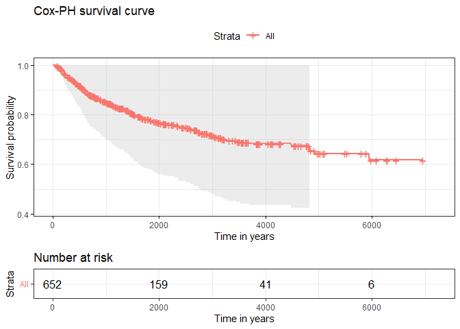
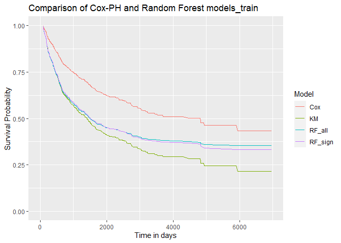
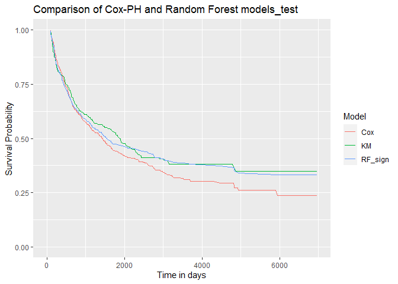
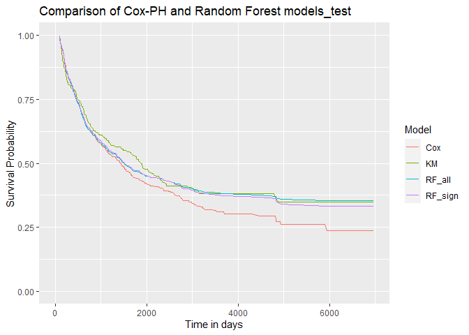

# Data

``` r
library(dplyr)
library(tidyverse)
dat_train <- readxl::read_xlsx("RevisedData/imputed_data_train.xlsx")%>%
  filter(DaysToRecurrence >= 90) %>%  # only +90 values in the duration column
  select(-c(Hospital, MRN, DOB)) %>% 
  # renaming the columns to avoid very long names
  rename(LiverDisease = UnderlyingLiverDisease_NASH_0_HepB_1_HepC_2_Alcohol_3_Other_4_,
         NAFLD = NAFLDVsNonNAFLD,
         Viral = ViralVs0nviral,
         Age = AgeAtResection_years_,
         Size = sizeOfLargestLesion_cm_,
         Sex = SexCodedM_0_F_1,
         Ethnicity = Ethnicity_0Aus_1Asian_2African3European4Other_,
         LVI = Lymphatic_vascularInvasion,
         PortalHTN = PortalHTN_HPVG_5mmhg_,
         HBsAg = HBsAgPositive,
         HepC = ChronicHepatitisC,
         TreatDiabetes = DiabetesTreatmentPriorToResectionY1N0,
         TreatHTN = TreatmentOfHTNPriorToResectionY1N0)

dat_test <- readxl::read_xlsx("RevisedData/binarized_data_test.xlsx") %>%
  filter(DaysToRecurrence >= 90) %>%  # only +90 values in the duration column
  select(-c(Hospital, MRN, DOB)) %>% 
  # renaming the columns to avoid very long names
  rename(LiverDisease = UnderlyingLiverDisease_NASH_0_HepB_1_HepC_2_Alcohol_3_Other_4_,
         NAFLD = NAFLDVsNonNAFLD,
         Viral = ViralVs0nviral,
         Age = AgeAtResection_years_,
         Size = sizeOfLargestLesion_cm_,
         Sex = SexCodedM_0_F_1,
         Ethnicity = Ethnicity_0Aus_1Asian_2African3European4Other_,
         LVI = Lymphatic_vascularInvasion,
         PortalHTN = PortalHTN_HPVG_5mmhg_,
         HBsAg = HBsAgPositive,
         HepC = ChronicHepatitisC,
         TreatDiabetes = DiabetesTreatmentPriorToResectionY1N0,
         TreatHTN = TreatmentOfHTNPriorToResectionY1N0)

dat_train[,3:31] <- lapply(dat_train[3:31], factor)  ## as.factor() could also be used
dat_test[,3:31] <- lapply(dat_test[3:31], factor)  ## as.factor() could also be used
```

# Modelling

## Kaplan Meier Analysis:

``` r
library(survival)
library(ggplot2)
library(survminer)

dat_train_yr <- dat_train %>% mutate(YearsToRecurrence = DaysToRecurrence / 365.25)
km_fit <- survfit(Surv(YearsToRecurrence, Recurrence) ~ 1, data=dat_train_yr)

# pdf("KM-0.pdf", width = 6, height = 6)
ggsurvplot(
  km_fit,
  data = dat_train_yr,
  # size = 1,                 # change line size
  # palette =
  #   c("#2E9FDF"),# custom color palettes  c("#E7B800", "#2E9FDF")
  conf.int = TRUE,          # Add confidence interval
  pval = TRUE,              # Add p-value
  risk.table = TRUE,        # Add risk table
  # risk.table.col = "strata",# Risk table color by groups
  # legend.labs =
  #   c("Male", "Female"),    # Change legend labels
  # risk.table.height = 0.25, # Useful to change when you have multiple groups
  ggtheme = theme_bw()      # Change ggplot2 theme
)
```


``` r
# dev.off()
```

## Kaplan Meier Analysis with group:

``` r
# ---------------------------------------------------------------------------------------#
# LiverDesease
km_trt_fit <- survfit(Surv(YearsToRecurrence, Recurrence) ~
                        LiverDisease,
                      data = dat_train_yr)

# pdf("KM_LiverDisease.pdf", width = 6, height = 6)
ggsurvplot(
  km_trt_fit,
  data = dat_train_yr,
  size = 1,                 # change line size
  conf.int = TRUE,          # Add confidence interval
  pval = TRUE,              # Add p-value
  risk.table = TRUE,        # Add risk table
  risk.table.col = "strata",# Risk table color by groups
  title = "Underlying liver disease",
  xlab = "Time in years",
  legend.labs =
    c("NASH", "HepB", "HepC", "Alcohol", "Other"),    # Change legend labels
  risk.table.height = 0.3, # Useful to change when you have multiple groups
  ggtheme = theme_bw()      # Change ggplot2 theme
)
```


``` r
# dev.off()

# ---------------------------------------------------------------------------------------#
# NAFLD
km_trt_fit <- survfit(Surv(YearsToRecurrence, Recurrence) ~
                        NAFLD,
                      data = dat_train_yr)

# pdf("KM_NAFLD.pdf", width = 6, height = 6)
ggsurvplot(
  km_trt_fit,
  data = dat_train_yr,
  size = 1,                 # change line size
  conf.int = TRUE,          # Add confidence interval
  pval = TRUE,              # Add p-value
  risk.table = TRUE,        # Add risk table
  risk.table.col = "strata",# Risk table color by groups
  title = "NAFLD",
  xlab = "Time in years",
  # legend.labs =
  #   c("NASH", "HepB", "HepC", "Alcohol", "Other"),    # Change legend labels
  risk.table.height = 0.3, # Useful to change when you have multiple groups
  ggtheme = theme_bw()      # Change ggplot2 theme
)
```


``` r
# dev.off()

# ---------------------------------------------------------------------------------------#
# Viral
km_trt_fit <- survfit(Surv(YearsToRecurrence, Recurrence) ~
                        Viral,
                      data = dat_train_yr)

# pdf("KM_Viral.pdf", width = 6, height = 6)
ggsurvplot(
  km_trt_fit,
  data = dat_train_yr,
  size = 1,                 # change line size
  conf.int = TRUE,          # Add confidence interval
  pval = TRUE,              # Add p-value
  risk.table = TRUE,        # Add risk table
  risk.table.col = "strata",# Risk table color by groups
  title = "Viral",
  xlab = "Time in years",
  # legend.labs =
  #   c("NASH", "HepB", "HepC", "Alcohol", "Other"),    # Change legend labels
  risk.table.height = 0.3, # Useful to change when you have multiple groups
  ggtheme = theme_bw()      # Change ggplot2 theme
)
```


``` r
# dev.off()

# ---------------------------------------------------------------------------------------#
# Age
km_trt_fit <- survfit(Surv(YearsToRecurrence, Recurrence) ~
                        Age,
                      data = dat_train_yr)

# pdf("KM_Age.pdf", width = 6, height = 6)
ggsurvplot(
  km_trt_fit,
  data = dat_train_yr,
  size = 1,                 # change line size
  conf.int = TRUE,          # Add confidence interval
  pval = TRUE,              # Add p-value
  risk.table = TRUE,        # Add risk table
  risk.table.col = "strata",# Risk table color by groups
  title = "Age 65 years",
  xlab = "Time in years",
  # legend.labs =
  #   c("NASH", "HepB", "HepC", "Alcohol", "Other"),    # Change legend labels
  risk.table.height = 0.3, # Useful to change when you have multiple groups
  ggtheme = theme_bw()      # Change ggplot2 theme
)
```


``` r
# dev.off()

# ---------------------------------------------------------------------------------------#
# PriorTACE
km_trt_fit <- survfit(Surv(YearsToRecurrence, Recurrence) ~
                        PriorTACE,
                      data = dat_train_yr)

# pdf("KM_PriorTACE.pdf", width = 6, height = 6)
ggsurvplot(
  km_trt_fit,
  data = dat_train_yr,
  size = 1,                 # change line size
  conf.int = TRUE,          # Add confidence interval
  pval = TRUE,              # Add p-value
  risk.table = TRUE,        # Add risk table
  risk.table.col = "strata",# Risk table color by groups
  title = "Prior TACE",
  xlab = "Time in years",
  # legend.labs =
  #   c("NASH", "HepB", "HepC", "Alcohol", "Other"),    # Change legend labels
  risk.table.height = 0.3, # Useful to change when you have multiple groups
  ggtheme = theme_bw()      # Change ggplot2 theme
)
```


``` r
# dev.off()

# ---------------------------------------------------------------------------------------#
# bili
km_trt_fit <- survfit(Surv(YearsToRecurrence, Recurrence) ~
                        bili,
                      data = dat_train_yr)

# pdf("KM_bili.pdf", width = 6, height = 6)
ggsurvplot(
  km_trt_fit,
  data = dat_train_yr,
  size = 1,                 # change line size
  conf.int = TRUE,          # Add confidence interval
  pval = TRUE,              # Add p-value
  risk.table = TRUE,        # Add risk table
  risk.table.col = "strata",# Risk table color by groups
  title = "Bilirubin",
  xlab = "Time in years",
  # legend.labs =
  #   c("NASH", "HepB", "HepC", "Alcohol", "Other"),    # Change legend labels
  risk.table.height = 0.3, # Useful to change when you have multiple groups
  ggtheme = theme_bw()      # Change ggplot2 theme
)
```


``` r
# dev.off()

# ---------------------------------------------------------------------------------------#
# albumin
km_trt_fit <- survfit(Surv(YearsToRecurrence, Recurrence) ~
                        albumin,
                      data = dat_train_yr)

# pdf("KM_albumin.pdf", width = 6, height = 6)
ggsurvplot(
  km_trt_fit,
  data = dat_train_yr,
  size = 1,                 # change line size
  conf.int = TRUE,          # Add confidence interval
  pval = TRUE,              # Add p-value
  risk.table = TRUE,        # Add risk table
  risk.table.col = "strata",# Risk table color by groups
  title = "Albumin",
  xlab = "Time in years",
  # legend.labs =
  #   c("NASH", "HepB", "HepC", "Alcohol", "Other"),    # Change legend labels
  risk.table.height = 0.3, # Useful to change when you have multiple groups
  ggtheme = theme_bw()      # Change ggplot2 theme
)
```


``` r
# dev.off()

# ---------------------------------------------------------------------------------------#
# INR
km_trt_fit <- survfit(Surv(YearsToRecurrence, Recurrence) ~
                        INR,
                      data = dat_train_yr)

# pdf("KM_INR.pdf", width = 6, height = 6)
ggsurvplot(
  km_trt_fit,
  data = dat_train_yr,
  size = 1,                 # change line size
  conf.int = TRUE,          # Add confidence interval
  pval = TRUE,              # Add p-value
  risk.table = TRUE,        # Add risk table
  risk.table.col = "strata",# Risk table color by groups
  title = "INR",
  xlab = "Time in years",
  # legend.labs =
  #   c("NASH", "HepB", "HepC", "Alcohol", "Other"),    # Change legend labels
  risk.table.height = 0.3, # Useful to change when you have multiple groups
  ggtheme = theme_bw()      # Change ggplot2 theme
)
```


``` r
# dev.off()

# ---------------------------------------------------------------------------------------#
# PlateletCount
km_trt_fit <- survfit(Surv(YearsToRecurrence, Recurrence) ~
                        PlateletCount,
                      data = dat_train_yr)

# pdf("KM_PlateletCount.pdf", width = 6, height = 6)
ggsurvplot(
  km_trt_fit,
  data = dat_train_yr,
  size = 1,                 # change line size
  conf.int = TRUE,          # Add confidence interval
  pval = TRUE,              # Add p-value
  risk.table = TRUE,        # Add risk table
  risk.table.col = "strata",# Risk table color by groups
  title = "Platelet count",
  xlab = "Time in years",
  # legend.labs =
  #   c("NASH", "HepB", "HepC", "Alcohol", "Other"),    # Change legend labels
  risk.table.height = 0.3, # Useful to change when you have multiple groups
  ggtheme = theme_bw()      # Change ggplot2 theme
)
```


``` r
# dev.off()

# ---------------------------------------------------------------------------------------#
# AFP
km_trt_fit <- survfit(Surv(YearsToRecurrence, Recurrence) ~
                        AFP,
                      data = dat_train_yr)

# pdf("KM_AFP.pdf", width = 6, height = 6)
ggsurvplot(
  km_trt_fit,
  data = dat_train_yr,
  size = 1,                 # change line size
  conf.int = TRUE,          # Add confidence interval
  pval = TRUE,              # Add p-value
  risk.table = TRUE,        # Add risk table
  risk.table.col = "strata",# Risk table color by groups
  title = "AFP",
  xlab = "Time in years",
  # legend.labs =
  #   c("NASH", "HepB", "HepC", "Alcohol", "Other"),    # Change legend labels
  risk.table.height = 0.3, # Useful to change when you have multiple groups
  ggtheme = theme_bw()      # Change ggplot2 theme
)
```


``` r
# dev.off()

# ---------------------------------------------------------------------------------------#
# numberOfLesions
km_trt_fit <- survfit(Surv(YearsToRecurrence, Recurrence) ~
                        numberOfLesions,
                      data = dat_train_yr)

# pdf("KM_numberOfLesions.pdf", width = 6, height = 6)
ggsurvplot(
  km_trt_fit,
  data = dat_train_yr,
  size = 1,                 # change line size
  conf.int = TRUE,          # Add confidence interval
  pval = TRUE,              # Add p-value
  risk.table = TRUE,        # Add risk table
  risk.table.col = "strata",# Risk table color by groups
  title = "Number of lesions > 1",
  xlab = "Time in years",
  # legend.labs =
  #   c("NASH", "HepB", "HepC", "Alcohol", "Other"),    # Change legend labels
  risk.table.height = 0.3, # Useful to change when you have multiple groups
  ggtheme = theme_bw()      # Change ggplot2 theme
)
```


``` r
# dev.off()

# ---------------------------------------------------------------------------------------#
# Size
km_trt_fit <- survfit(Surv(YearsToRecurrence, Recurrence) ~
                        Size,
                      data = dat_train_yr)

# pdf("KM_Size.pdf", width = 6, height = 6)
ggsurvplot(
  km_trt_fit,
  data = dat_train_yr,
  size = 1,                 # change line size
  conf.int = TRUE,          # Add confidence interval
  pval = TRUE,              # Add p-value
  risk.table = TRUE,        # Add risk table
  risk.table.col = "strata",# Risk table color by groups
  title = "Size of the largest lesion >= 5cm",
  xlab = "Time in years",
  # legend.labs =
  #   c("NASH", "HepB", "HepC", "Alcohol", "Other"),    # Change legend labels
  risk.table.height = 0.3, # Useful to change when you have multiple groups
  ggtheme = theme_bw()      # Change ggplot2 theme
)
```


``` r
# dev.off()

# ---------------------------------------------------------------------------------------#
# satellite
km_trt_fit <- survfit(Surv(YearsToRecurrence, Recurrence) ~
                        satellite,
                      data = dat_train_yr)

# pdf("KM_satellite.pdf", width = 6, height = 6)
ggsurvplot(
  km_trt_fit,
  data = dat_train_yr,
  size = 1,                 # change line size
  conf.int = TRUE,          # Add confidence interval
  pval = TRUE,              # Add p-value
  risk.table = TRUE,        # Add risk table
  risk.table.col = "strata",# Risk table color by groups
  title = "Satellite lesions",
  xlab = "Time in years",
  # legend.labs =
  #   c("NASH", "HepB", "HepC", "Alcohol", "Other"),    # Change legend labels
  risk.table.height = 0.3, # Useful to change when you have multiple groups
  ggtheme = theme_bw()      # Change ggplot2 theme
)
```


``` r
# dev.off()

# ---------------------------------------------------------------------------------------#
# cirrhosis
km_trt_fit <- survfit(Surv(YearsToRecurrence, Recurrence) ~
                        cirrhosis,
                      data = dat_train_yr)
# pdf("KM_cirrhosis.pdf", width = 6, height = 6)
ggsurvplot(
  km_trt_fit,
  data = dat_train_yr,
  size = 1,                 # change line size
  conf.int = TRUE,          # Add confidence interval
  pval = TRUE,              # Add p-value
  risk.table = TRUE,        # Add risk table
  risk.table.col = "strata",# Risk table color by groups
  title = "Cirrhosis",
  xlab = "Time in years",
  # legend.labs =
  #   c("NASH", "HepB", "HepC", "Alcohol", "Other"),    # Change legend labels
  risk.table.height = 0.3, # Useful to change when you have multiple groups
  ggtheme = theme_bw()      # Change ggplot2 theme
)
```


``` r
# dev.off()

# ---------------------------------------------------------------------------------------#
# Sex
km_trt_fit <- survfit(Surv(YearsToRecurrence, Recurrence) ~
                        Sex,
                      data = dat_train_yr)

# pdf("KM_Sex.pdf", width = 6, height = 6)
ggsurvplot(
  km_trt_fit,
  data = dat_train_yr,
  size = 1,                 # change line size
  conf.int = TRUE,          # Add confidence interval
  pval = TRUE,              # Add p-value
  risk.table = TRUE,        # Add risk table
  risk.table.col = "strata",# Risk table color by groups
  title = "Gender",
  xlab = "Time in years",
  legend.labs =
    c("Female", "Male"),    # Change legend labels
  risk.table.height = 0.3, # Useful to change when you have multiple groups
  ggtheme = theme_bw()      # Change ggplot2 theme
)
```


``` r
# dev.off()

# ---------------------------------------------------------------------------------------#
# Ethnicity
km_trt_fit <- survfit(Surv(YearsToRecurrence, Recurrence) ~
                        Ethnicity,
                      data = dat_train_yr)

# pdf("KM_Ethnicity.pdf", width = 6, height = 6)
ggsurvplot(
  km_trt_fit,
  data = dat_train_yr,
  size = 1,                 # change line size
  conf.int = TRUE,          # Add confidence interval
  pval = TRUE,              # Add p-value
  risk.table = TRUE,        # Add risk table
  risk.table.col = "strata",# Risk table color by groups
  title = "Ethnicity",
  xlab = "Time in years",
  legend.labs =
    c("Caucasian", "Asian", "Others"),    # Change legend labels
  risk.table.height = 0.3, # Useful to change when you have multiple groups
  ggtheme = theme_bw()      # Change ggplot2 theme
)
```


``` r
# dev.off()

# ---------------------------------------------------------------------------------------#
# LVI
km_trt_fit <- survfit(Surv(YearsToRecurrence, Recurrence) ~
                        LVI,
                      data = dat_train_yr)

# pdf("KM_LVI.pdf", width = 6, height = 6)
ggsurvplot(
  km_trt_fit,
  data = dat_train_yr,
  size = 1,                 # change line size
  conf.int = TRUE,          # Add confidence interval
  pval = TRUE,              # Add p-value
  risk.table = TRUE,        # Add risk table
  risk.table.col = "strata",# Risk table color by groups
  title = "Lymphatic vascular invasion",
  xlab = "Time in years",
  # legend.labs =
  #   c("NASH", "HepB", "HepC", "Alcohol", "Other"),    # Change legend labels
  risk.table.height = 0.3, # Useful to change when you have multiple groups
  ggtheme = theme_bw()      # Change ggplot2 theme
)
```


``` r
# dev.off()

# ---------------------------------------------------------------------------------------#
# PortalHTN
km_trt_fit <- survfit(Surv(YearsToRecurrence, Recurrence) ~
                        PortalHTN,
                      data = dat_train_yr)

# pdf("KM_PortalHTN.pdf", width = 6, height = 6)
ggsurvplot(
  km_trt_fit,
  data = dat_train_yr,
  size = 1,                 # change line size
  conf.int = TRUE,          # Add confidence interval
  pval = TRUE,              # Add p-value
  risk.table = TRUE,        # Add risk table
  risk.table.col = "strata",# Risk table color by groups
  title = "Portal HTN HPVG 5mmhg",
  xlab = "Time in years",
  # legend.labs =
  #   c("NASH", "HepB", "HepC", "Alcohol", "Other"),    # Change legend labels
  risk.table.height = 0.3, # Useful to change when you have multiple groups
  ggtheme = theme_bw()      # Change ggplot2 theme
)
```


``` r
# dev.off()

# ---------------------------------------------------------------------------------------#
# HBsAg
km_trt_fit <- survfit(Surv(YearsToRecurrence, Recurrence) ~
                        HBsAg,
                      data = dat_train_yr)

# pdf("KM_HBsAg.pdf", width = 6, height = 6)
ggsurvplot(
  km_trt_fit,
  data = dat_train_yr,
  size = 1,                 # change line size
  conf.int = TRUE,          # Add confidence interval
  pval = TRUE,              # Add p-value
  risk.table = TRUE,        # Add risk table
  risk.table.col = "strata",# Risk table color by groups
  title = "HBs ag positive",
  xlab = "Time in years",
  # legend.labs =
  #   c("NASH", "HepB", "HepC", "Alcohol", "Other"),    # Change legend labels
  risk.table.height = 0.3, # Useful to change when you have multiple groups
  ggtheme = theme_bw()      # Change ggplot2 theme
)
```


``` r
# dev.off()

# ---------------------------------------------------------------------------------------#
# ALT
km_trt_fit <- survfit(Surv(YearsToRecurrence, Recurrence) ~
                        ALT,
                      data = dat_train_yr)

# pdf("KM_ALT.pdf", width = 6, height = 6)
ggsurvplot(
  km_trt_fit,
  data = dat_train_yr,
  size = 1,                 # change line size
  conf.int = TRUE,          # Add confidence interval
  pval = TRUE,              # Add p-value
  risk.table = TRUE,        # Add risk table
  risk.table.col = "strata",# Risk table color by groups
  title = "ALT",
  xlab = "Time in years",
  # legend.labs =
  #   c("NASH", "HepB", "HepC", "Alcohol", "Other"),    # Change legend labels
  risk.table.height = 0.3, # Useful to change when you have multiple groups
  ggtheme = theme_bw()      # Change ggplot2 theme
)
```


``` r
# dev.off()

# ---------------------------------------------------------------------------------------#
# HepC
km_trt_fit <- survfit(Surv(YearsToRecurrence, Recurrence) ~
                        HepC,
                      data = dat_train_yr)

# pdf("KM_HepC.pdf", width = 6, height = 6)
ggsurvplot(
  km_trt_fit,
  data = dat_train_yr,
  size = 1,                 # change line size
  conf.int = TRUE,          # Add confidence interval
  pval = TRUE,              # Add p-value
  risk.table = TRUE,        # Add risk table
  risk.table.col = "strata",# Risk table color by groups
  title = "Chronic Hepatitis C",
  xlab = "Time in years",
  # legend.labs =
  #   c("NASH", "HepB", "HepC", "Alcohol", "Other"),    # Change legend labels
  risk.table.height = 0.3, # Useful to change when you have multiple groups
  ggtheme = theme_bw()      # Change ggplot2 theme
)
```


``` r
# dev.off()

# ---------------------------------------------------------------------------------------#
# BMI
km_trt_fit <- survfit(Surv(YearsToRecurrence, Recurrence) ~
                        BMI,
                      data = dat_train_yr)

# pdf("KM_BMI.pdf", width = 6, height = 6)
ggsurvplot(
  km_trt_fit,
  data = dat_train_yr,
  size = 1,                 # change line size
  conf.int = TRUE,          # Add confidence interval
  pval = TRUE,              # Add p-value
  risk.table = TRUE,        # Add risk table
  risk.table.col = "strata",# Risk table color by groups
  title = "BMI",
  xlab = "Time in years",
  # legend.labs =
  #   c("NASH", "HepB", "HepC", "Alcohol", "Other"),    # Change legend labels
  risk.table.height = 0.3, # Useful to change when you have multiple groups
  ggtheme = theme_bw()      # Change ggplot2 theme
)
```


``` r
# dev.off()

# ---------------------------------------------------------------------------------------#
# DM
km_trt_fit <- survfit(Surv(YearsToRecurrence, Recurrence) ~
                        DM,
                      data = dat_train_yr)

# pdf("KM_DM.pdf", width = 6, height = 6)
ggsurvplot(
  km_trt_fit,
  data = dat_train_yr,
  size = 1,                 # change line size
  conf.int = TRUE,          # Add confidence interval
  pval = TRUE,              # Add p-value
  risk.table = TRUE,        # Add risk table
  risk.table.col = "strata",# Risk table color by groups
  title = "DM",
  xlab = "Time in years",
  # legend.labs =
  #   c("NASH", "HepB", "HepC", "Alcohol", "Other"),    # Change legend labels
  risk.table.height = 0.3, # Useful to change when you have multiple groups
  ggtheme = theme_bw()      # Change ggplot2 theme
)
```


``` r
# dev.off()

# ---------------------------------------------------------------------------------------#
# TreatDiabetes
km_trt_fit <- survfit(Surv(YearsToRecurrence, Recurrence) ~
                        TreatDiabetes,
                      data = dat_train_yr)

# pdf("KM_TreatDiabetes.pdf", width = 6, height = 6)
ggsurvplot(
  km_trt_fit,
  data = dat_train_yr,
  size = 1,                 # change line size
  conf.int = TRUE,          # Add confidence interval
  pval = TRUE,              # Add p-value
  risk.table = TRUE,        # Add risk table
  risk.table.col = "strata",# Risk table color by groups
  title = "Diabetes treatment prior to resection",
  xlab = "Time in years",
  # legend.labs =
  #   c("NASH", "HepB", "HepC", "Alcohol", "Other"),    # Change legend labels
  risk.table.height = 0.3, # Useful to change when you have multiple groups
  ggtheme = theme_bw()      # Change ggplot2 theme
)
```


``` r
# dev.off()

# ---------------------------------------------------------------------------------------#
# Hypertension
km_trt_fit <- survfit(Surv(YearsToRecurrence, Recurrence) ~
                        Hypertension,
                      data = dat_train_yr)

# pdf("KM_Hypertension.pdf", width = 6, height = 6)
ggsurvplot(
  km_trt_fit,
  data = dat_train_yr,
  size = 1,                 # change line size
  conf.int = TRUE,          # Add confidence interval
  pval = TRUE,              # Add p-value
  risk.table = TRUE,        # Add risk table
  risk.table.col = "strata",# Risk table color by groups
  title = "Hypertension",
  xlab = "Time in years",
  # legend.labs =
  #   c("NASH", "HepB", "HepC", "Alcohol", "Other"),    # Change legend labels
  risk.table.height = 0.3, # Useful to change when you have multiple groups
  ggtheme = theme_bw()      # Change ggplot2 theme
)
```


``` r
# dev.off()

# ---------------------------------------------------------------------------------------#
# TreatHTN
km_trt_fit <- survfit(Surv(YearsToRecurrence, Recurrence) ~
                        TreatHTN,
                      data = dat_train_yr)

# pdf("KM_TreatHTN.pdf", width = 6, height = 6)
ggsurvplot(
  km_trt_fit,
  data = dat_train_yr,
  size = 1,                 # change line size
  conf.int = TRUE,          # Add confidence interval
  pval = TRUE,              # Add p-value
  risk.table = TRUE,        # Add risk table
  risk.table.col = "strata",# Risk table color by groups
  title = "Treatment of HTN prior to resection",
  xlab = "Time in years",
  # legend.labs =
  #   c("NASH", "HepB", "HepC", "Alcohol", "Other"),    # Change legend labels
  risk.table.height = 0.3, # Useful to change when you have multiple groups
  ggtheme = theme_bw()      # Change ggplot2 theme
)
```


``` r
# dev.off()

# ---------------------------------------------------------------------------------------#
# eGFR
km_trt_fit <- survfit(Surv(YearsToRecurrence, Recurrence) ~
                        eGFR,
                      data = dat_train_yr)

# pdf("KM_eGFR.pdf", width = 6, height = 6)
ggsurvplot(
  km_trt_fit,
  data = dat_train_yr,
  size = 1,                 # change line size
  conf.int = TRUE,          # Add confidence interval
  pval = TRUE,              # Add p-value
  risk.table = TRUE,        # Add risk table
  risk.table.col = "strata",# Risk table color by groups
  title = "eGFR",
  xlab = "Time in years",
  # legend.labs =
  #   c("NASH", "HepB", "HepC", "Alcohol", "Other"),    # Change legend labels
  risk.table.height = 0.3, # Useful to change when you have multiple groups
  ggtheme = theme_bw()      # Change ggplot2 theme
)
```


``` r
# dev.off()

# ---------------------------------------------------------------------------------------#
# IHD
km_trt_fit <- survfit(Surv(YearsToRecurrence, Recurrence) ~
                        IHD,
                      data = dat_train_yr)

# pdf("KM_IHD.pdf", width = 6, height = 6)
ggsurvplot(
  km_trt_fit,
  data = dat_train_yr,
  size = 1,                 # change line size
  conf.int = TRUE,          # Add confidence interval
  pval = TRUE,              # Add p-value
  risk.table = TRUE,        # Add risk table
  risk.table.col = "strata",# Risk table color by groups
  title = "IHD",
  xlab = "Time in years",
  # legend.labs =
  #   c("NASH", "HepB", "HepC", "Alcohol", "Other"),    # Change legend labels
  risk.table.height = 0.3, # Useful to change when you have multiple groups
  ggtheme = theme_bw()      # Change ggplot2 theme
)
```


``` r
# dev.off()

# ---------------------------------------------------------------------------------------#
# CVS
km_trt_fit <- survfit(Surv(YearsToRecurrence, Recurrence) ~
                        CVS,
                      data = dat_train_yr)

# pdf("KM_CVS.pdf", width = 6, height = 6)
ggsurvplot(
  km_trt_fit,
  data = dat_train_yr,
  size = 1,                 # change line size
  conf.int = TRUE,          # Add confidence interval
  pval = TRUE,              # Add p-value
  risk.table = TRUE,        # Add risk table
  risk.table.col = "strata",# Risk table color by groups
  title = "CVS",
  xlab = "Time in years",
  # legend.labs =
  #   c("NASH", "HepB", "HepC", "Alcohol", "Other"),    # Change legend labels
  risk.table.height = 0.3, # Useful to change when you have multiple groups
  ggtheme = theme_bw()      # Change ggplot2 theme
)
```


``` r
# dev.off()
```

## Semi-parametric Cox-PH Model:

### Fit Cox Model

``` r
cox <- coxph(Surv(DaysToRecurrence, Recurrence) ~ . , data = dat_train)
summary(cox)
```

    ## Call:
    ## coxph(formula = Surv(DaysToRecurrence, Recurrence) ~ ., data = dat_train)
    ## 
    ##   n= 652, number of events= 376 
    ## 
    ##                      coef exp(coef) se(coef)      z Pr(>|z|)    
    ## LiverDisease1    -0.91065   0.40226  0.85191 -1.069 0.285091    
    ## LiverDisease2    -0.47576   0.62141  0.76839 -0.619 0.535809    
    ## LiverDisease3     0.14849   1.16008  0.58087  0.256 0.798237    
    ## LiverDisease4     0.39770   1.48839  0.58914  0.675 0.499643    
    ## NAFLD1            0.13350   1.14282  0.54742  0.244 0.807336    
    ## Viral1            0.70707   2.02803  0.57281  1.234 0.217061    
    ## Age1              0.25539   1.29096  0.13148  1.942 0.052077 .  
    ## PriorTACE1       -0.28806   0.74971  0.19881 -1.449 0.147360    
    ## bili1             0.06998   1.07249  0.18658  0.375 0.707605    
    ## albumin1          0.31257   1.36693  0.15706  1.990 0.046573 *  
    ## INR1              0.24831   1.28185  0.12691  1.957 0.050397 .  
    ## PlateletCount1    0.16768   1.18256  0.12271  1.366 0.171789    
    ## AFP1              0.14369   1.15452  0.13302  1.080 0.280066    
    ## AFP2              0.24684   1.27998  0.13573  1.819 0.068961 .  
    ## numberOfLesions1  0.41243   1.51048  0.18120  2.276 0.022840 *  
    ## Size1             0.37605   1.45652  0.12781  2.942 0.003257 ** 
    ## satellite1       -0.03619   0.96445  0.20188 -0.179 0.857719    
    ## cirrhosis1        0.38786   1.47383  0.13093  2.962 0.003053 ** 
    ## Sex1              0.32246   1.38052  0.15887  2.030 0.042383 *  
    ## Ethnicity1        0.00521   1.00522  0.19045  0.027 0.978176    
    ## Ethnicity2       -0.47925   0.61925  0.30929 -1.550 0.121261    
    ## LVI1              0.43001   1.53727  0.12277  3.503 0.000461 ***
    ## PortalHTN1        0.01763   1.01779  0.17533  0.101 0.919888    
    ## HBsAg1            0.21532   1.24026  0.27722  0.777 0.437341    
    ## ALT1              0.05969   1.06150  0.11723  0.509 0.610659    
    ## HepC1             0.07470   1.07756  0.32101  0.233 0.815986    
    ## BMI1             -0.18918   0.82764  0.12734 -1.486 0.137382    
    ## DM1               0.11868   1.12601  0.47782  0.248 0.803840    
    ## TreatDiabetes1    0.10147   1.10680  0.48191  0.211 0.833229    
    ## Hypertension1     0.15093   1.16292  0.48202  0.313 0.754188    
    ## TreatHTN1        -0.25172   0.77746  0.48704 -0.517 0.605277    
    ## eGFR1            -0.01761   0.98255  0.11067 -0.159 0.873575    
    ## IHD1              0.02285   1.02311  0.30545  0.075 0.940369    
    ## CVS1              0.46874   1.59797  0.27841  1.684 0.092253 .  
    ## ---
    ## Signif. codes:  0 '***' 0.001 '**' 0.01 '*' 0.05 '.' 0.1 ' ' 1
    ## 
    ##                  exp(coef) exp(-coef) lower .95 upper .95
    ## LiverDisease1       0.4023     2.4859   0.07575     2.136
    ## LiverDisease2       0.6214     1.6092   0.13782     2.802
    ## LiverDisease3       1.1601     0.8620   0.37158     3.622
    ## LiverDisease4       1.4884     0.6719   0.46908     4.723
    ## NAFLD1              1.1428     0.8750   0.39085     3.341
    ## Viral1              2.0280     0.4931   0.65993     6.232
    ## Age1                1.2910     0.7746   0.99771     1.670
    ## PriorTACE1          0.7497     1.3338   0.50777     1.107
    ## bili1               1.0725     0.9324   0.74400     1.546
    ## albumin1            1.3669     0.7316   1.00475     1.860
    ## INR1                1.2819     0.7801   0.99957     1.644
    ## PlateletCount1      1.1826     0.8456   0.92976     1.504
    ## AFP1                1.1545     0.8662   0.88956     1.498
    ## AFP2                1.2800     0.7813   0.98101     1.670
    ## numberOfLesions1    1.5105     0.6620   1.05896     2.155
    ## Size1               1.4565     0.6866   1.13378     1.871
    ## satellite1          0.9645     1.0369   0.64929     1.433
    ## cirrhosis1          1.4738     0.6785   1.14024     1.905
    ## Sex1                1.3805     0.7244   1.01115     1.885
    ## Ethnicity1          1.0052     0.9948   0.69207     1.460
    ## Ethnicity2          0.6192     1.6149   0.33775     1.135
    ## LVI1                1.5373     0.6505   1.20852     1.955
    ## PortalHTN1          1.0178     0.9825   0.72180     1.435
    ## HBsAg1              1.2403     0.8063   0.72034     2.135
    ## ALT1                1.0615     0.9421   0.84359     1.336
    ## HepC1               1.0776     0.9280   0.57438     2.022
    ## BMI1                0.8276     1.2083   0.64483     1.062
    ## DM1                 1.1260     0.8881   0.44139     2.873
    ## TreatDiabetes1      1.1068     0.9035   0.43039     2.846
    ## Hypertension1       1.1629     0.8599   0.45212     2.991
    ## TreatHTN1           0.7775     1.2862   0.29930     2.020
    ## eGFR1               0.9825     1.0178   0.79096     1.221
    ## IHD1                1.0231     0.9774   0.56224     1.862
    ## CVS1                1.5980     0.6258   0.92595     2.758
    ## 
    ## Concordance= 0.67  (se = 0.015 )
    ## Likelihood ratio test= 111.8  on 34 df,   p=3e-10
    ## Wald test            = 118.5  on 34 df,   p=3e-11
    ## Score (logrank) test = 123.3  on 34 df,   p=5e-12

``` r
# write.csv(tidy(cox), file = "cox.csv")

cox_fit <- survfit(cox)

# autoplot(cox_fit)

# pdf("KM-cox.pdf", width = 6, height = 6)

ggsurvplot(
  cox_fit,
  data = dat_train,
  # size = 1,                 # change line size
  # palette =
  #   c("#2E9FDF"),# custom color palettes  c("#E7B800", "#2E9FDF")
  conf.int = TRUE,          # Add confidence interval
  # pval = TRUE,              # Add p-value
  risk.table = TRUE,        # Add risk table
  title = "Cox-PH survival curve",
  xlab = "Time in years",
  ylim = c(0.42, 1),
  xlim = c(0, 7200),
  # risk.table.col = "strata",# Risk table color by groups
  # legend.labs =
  #   c("Male", "Female"),    # Change legend labels
  # risk.table.height = 0.25, # Useful to change when you have multiple groups
  ggtheme = theme_bw()      # Change ggplot2 theme
) 
```



``` r
# dev.off()
```

## The impact of covariates over time:

(Aalen’s additive regression model for censored data)

``` r
aa_fit <-aareg(Surv(DaysToRecurrence, Recurrence) ~ . , data = dat_train)
aa_fit
```

    ## Call:
    ## aareg(formula = Surv(DaysToRecurrence, Recurrence) ~ ., data = dat_train)
    ## 
    ##   n= 652 
    ##     205 out of 327 unique event times used
    ## 
    ##                      slope      coef se(coef)       z        p
    ## Intercept        -6.56e-04 -7.39e-04 0.001550 -0.4760 0.634000
    ## LiverDisease1     1.32e-04 -1.21e-03 0.002460 -0.4900 0.624000
    ## LiverDisease2     3.08e-04 -1.20e-03 0.002240 -0.5340 0.593000
    ## LiverDisease3     1.26e-05  3.82e-05 0.001510  0.0253 0.980000
    ## LiverDisease4     5.31e-04  8.10e-04 0.001540  0.5270 0.598000
    ## NAFLD1            1.28e-04 -5.60e-05 0.001470 -0.0382 0.970000
    ## Viral1           -5.80e-05  1.03e-03 0.001920  0.5390 0.590000
    ## Age1              1.38e-04  3.04e-04 0.000299  1.0200 0.309000
    ## PriorTACE1       -6.53e-05 -2.99e-04 0.000480 -0.6230 0.534000
    ## bili1             2.33e-04  6.72e-04 0.000564  1.1900 0.233000
    ## albumin1          3.67e-04  7.93e-04 0.000487  1.6300 0.104000
    ## INR1              1.71e-04  6.10e-04 0.000364  1.6800 0.093700
    ## PlateletCount1    1.41e-04  3.26e-04 0.000299  1.0900 0.276000
    ## AFP1              3.64e-04  7.32e-04 0.000309  2.3700 0.017900
    ## AFP2              6.26e-04  1.13e-03 0.000337  3.3500 0.000796
    ## numberOfLesions1  6.58e-04  1.33e-03 0.000628  2.1200 0.033800
    ## Size1             4.75e-04  1.06e-03 0.000344  3.0900 0.001990
    ## satellite1        2.77e-04  1.99e-04 0.000713  0.2800 0.780000
    ## cirrhosis1        1.83e-04  4.05e-04 0.000285  1.4200 0.155000
    ## Sex1              2.27e-04  4.29e-04 0.000321  1.3400 0.181000
    ## Ethnicity1        5.94e-05  9.25e-05 0.000523  0.1770 0.859000
    ## Ethnicity2       -5.13e-04 -7.58e-04 0.000657 -1.1500 0.249000
    ## LVI1              6.17e-04  1.26e-03 0.000349  3.6200 0.000291
    ## PortalHTN1       -3.19e-05  1.58e-04 0.000483  0.3270 0.743000
    ## HBsAg1            1.55e-04  3.92e-04 0.000847  0.4630 0.643000
    ## ALT1              1.11e-04  2.75e-04 0.000316  0.8700 0.385000
    ## HepC1             2.19e-04  6.30e-04 0.000734  0.8570 0.391000
    ## BMI1             -5.33e-05 -1.64e-04 0.000263 -0.6220 0.534000
    ## DM1              -7.47e-06 -2.76e-04 0.000544 -0.5070 0.612000
    ## TreatDiabetes1    3.13e-04  8.15e-04 0.000581  1.4000 0.161000
    ## Hypertension1    -5.37e-04 -3.08e-04 0.001320 -0.2330 0.816000
    ## TreatHTN1         9.55e-05 -2.70e-04 0.001320 -0.2040 0.838000
    ## eGFR1            -6.51e-05 -1.96e-04 0.000256 -0.7660 0.444000
    ## IHD1             -1.36e-05 -1.94e-04 0.000687 -0.2830 0.777000
    ## CVS1              5.50e-05  3.93e-04 0.000724  0.5420 0.588000
    ## 
    ## Chisq=89.04 on 34 df, p=8.07e-07; test weights=aalen

``` r
# pdf("cox_time.pdf", width = 11, height = 8)
library(ggfortify)
autoplot(aa_fit)
```


``` r
# dev.off()
```

## C-index for train and test sets:

``` r
library(Hmisc)
# For train set
SurvObj_train <- Surv(dat_train$DaysToRecurrence, dat_train$Recurrence)
predicted_train <- predict(cox, newdata=dat_train)
c_index_result_train <- rcorr.cens(x= -predicted_train, S=SurvObj_train) #concordance(cox)

# For test set
SurvObj_test <- Surv(dat_test$DaysToRecurrence, dat_test$Recurrence)
predicted_test <- predict(cox, newdata=dat_test)
c_index_result_test <- rcorr.cens(x= -predicted_test, S=SurvObj_test) #concordance(cox)

paste("In the Cox model: the C-Index is ", round(c_index_result_train[1], 3)," for the train set, ",
      "and the C-index is ", round(c_index_result_test[1], 3), " for the test set.")
```

    ## [1] "In the Cox model: the C-Index is  0.67  for the train set,  and the C-index is  0.642  for the test set."

## Survival-based Random Forest model:

### ranger model

``` r
unique.death.times_train <- dat_train %>% filter(Recurrence == 1) %>% select(DaysToRecurrence) %>% unlist() %>% unique() %>% sort()
unique.death.times_test <- dat_test %>% filter(Recurrence == 1) %>% select(DaysToRecurrence) %>% unlist() %>% unique() %>% sort()

library(ranger)
r_fit_all <- ranger(Surv(DaysToRecurrence, Recurrence) ~ . ,
                    data = dat_train,
                     mtry = 4,
                     importance = "permutation",
                     splitrule = "extratrees",
                     verbose = TRUE)

r_fit_sign <- ranger(Surv(DaysToRecurrence, Recurrence) ~ 
                  albumin + numberOfLesions + Size +
                    cirrhosis + Sex + LVI,
                  data = dat_train,
                     mtry = 4,
                     importance = "permutation",
                     splitrule = "extratrees",
                     verbose = TRUE)

# Average the survival models
death_times_all <- r_fit_all$unique.death.times
surv_prob_all <- data.frame(r_fit_all$survival)
avg_prob_all <- sapply(surv_prob_all,mean)

# Predict on the test set
r_pred_all_test <- predict(r_fit_all, data = dat_test)

# Extract survival probabilities
surv_prob_all_test <- data.frame(r_pred_all_test$survival)
avg_prob_all_test <- sapply(surv_prob_all_test,mean)

# Average the survival models
death_times_sign <- r_fit_sign$unique.death.times
surv_prob_sign <- data.frame(r_fit_sign$survival)
avg_prob_sign <- sapply(surv_prob_sign,mean)

# Predict on the test set
r_pred_sign_test <- predict(r_fit_sign, data = dat_test)

# Extract survival probabilities
surv_prob_sign_test <- data.frame(r_pred_sign_test$survival)
avg_prob_sign_test <- sapply(surv_prob_sign_test,mean)

# pdf("RF_patients.pdf", width = 8, height = 6)
# Plot the survival models for each patient
plot(r_fit_sign$unique.death.times,r_fit_sign$survival[1,],
     type = "l",
     ylim = c(0,1),
     col = "red",
     xlab = "Days",
     ylab = "survival",
     main = "Patient Survival Curves")


cols <- colors()
for (n in sample(c(2:dim(dat_train)[1]), 40)){
  lines(r_fit_sign$unique.death.times, r_fit_sign$survival[n,], type = "l", col = cols[n])
}
lines(death_times_sign, avg_prob_sign, lwd = 2)
legend(4000, 0.8, legend = c('Average = black'))
```


``` r
# dev.off()
```

#### ranger in MLR package

##### All features

``` r
library(mlr) #install.packages("mlr")
task_mlr = makeSurvTask(data = dat_train, target = c("DaysToRecurrence", "Recurrence"))

surv_lrn_mlr = makeLearner("surv.ranger", id = "rng") #lrns = listLearners()

mod = train(surv_lrn_mlr, task_mlr)

mod
```

    ## Model for learner.id=rng; learner.class=surv.ranger
    ## Trained on: task.id = dat_train; obs = 652; features = 29
    ## Hyperparameters: num.threads=1,verbose=FALSE,respect.unordered.factors=order

``` r
Pred_train = predict(mod, newdata = dat_train)
Pred_train
```

    ## Prediction: 652 observations
    ## predict.type: response
    ## threshold: 
    ## time: 4.32
    ##   truth.time truth.event  response
    ## 1        284           1 0.5785264
    ## 2        353           1 0.7316340
    ## 3       2922           1 0.3331224
    ## 4        190           1 0.6876922
    ## 5        514           0 0.4817271
    ## 6        284           0 0.3761565
    ## ... (#rows: 652, #cols: 3)

``` r
Pred_test = predict(mod, newdata = dat_test)
Pred_test
```

    ## Prediction: 260 observations
    ## predict.type: response
    ## threshold: 
    ## time: 1.89
    ##   truth.time truth.event  response
    ## 1       2334           1 0.3388795
    ## 2       1436           1 0.4789547
    ## 3       1137           1 0.3841441
    ## 4       1035           1 0.6949488
    ## 5        681           1 0.7208008
    ## 6       4873           1 0.4870322
    ## ... (#rows: 260, #cols: 3)

``` r
c_index_result_train_RF <- performance(Pred_train) #listMeasures(task_mlr)
c_index_result_test_RF <- performance(Pred_test)

paste("In the Random Forest model: the C-Index is ", round(c_index_result_train_RF[1], 3)," for the train set, ",
      "and the C-index is ", round(c_index_result_test_RF[1], 3), " for the test set.")
```

    ## [1] "In the Random Forest model: the C-Index is  0.846  for the train set,  and the C-index is  0.637  for the test set."

#### ranger in MLR package

##### Significant features

``` r
library(mlr) #install.packages("mlr")
dat_train_sign <- dat_train %>% select(c(DaysToRecurrence, Recurrence, albumin, numberOfLesions, Size, cirrhosis, Sex, LVI))
dat_test_sign <- dat_test %>% select(c(DaysToRecurrence, Recurrence, albumin, numberOfLesions, Size, cirrhosis, Sex, LVI))

task_mlr_sign = makeSurvTask(data =dat_train_sign, target = c("DaysToRecurrence", "Recurrence"))

surv_lrn_mlr = makeLearner("surv.ranger", id = "rng") #lrns = listLearners()

mod_sign = train(surv_lrn_mlr, task_mlr_sign)

Pred_train_sign = predict(mod_sign, newdata = dat_train_sign)
Pred_train_sign
```

    ## Prediction: 652 observations
    ## predict.type: response
    ## threshold: 
    ## time: 3.59
    ##   truth.time truth.event  response
    ## 1        284           1 0.2325847
    ## 2        353           1 0.4533719
    ## 3       2922           1 0.4868506
    ## 4        190           1 0.5561497
    ## 5        514           0 0.8527350
    ## 6        284           0 0.9494557
    ## ... (#rows: 652, #cols: 3)

``` r
Pred_test_sign = predict(mod_sign, newdata = dat_test_sign)
Pred_test_sign
```

    ## Prediction: 260 observations
    ## predict.type: response
    ## threshold: 
    ## time: 1.02
    ##   truth.time truth.event  response
    ## 1       2334           1 0.2333366
    ## 2       1436           1 0.4130535
    ## 3       1137           1 0.4079413
    ## 4       1035           1 0.5561497
    ## 5        681           1 0.9494557
    ## 6       4873           1 0.2333366
    ## ... (#rows: 260, #cols: 3)

``` r
c_index_result_train_RF_sign <- performance(Pred_train_sign) #listMeasures(task_mlr)
c_index_result_test_RF_sign <- performance(Pred_test_sign)

paste("In the Random Forest model: the C-Index is ", round(c_index_result_train_RF_sign[1], 3)," for the train set, ",
      "and the C-index is ", round(c_index_result_test_RF_sign[1], 3), " for the test set.")
```

    ## [1] "In the Random Forest model: the C-Index is  0.654  for the train set,  and the C-index is  0.634  for the test set."

## Comparison of the three models, Kaplan Meier, Cox-PH, and Random Forest:

### Train set

``` r
# Set up for ggplot
km_fit <- survfit(Surv(DaysToRecurrence, Recurrence) ~ 1, data=dat_test)
kmi <- rep("KM",length(km_fit$time))
km_df <- data.frame(km_fit$time,km_fit$surv,kmi)
names(km_df) <- c("Time","Surv","Model")

coxi <- rep("Cox",length(cox_fit$time))
cox_df <- data.frame(cox_fit$time,cox_fit$surv,coxi)
names(cox_df) <- c("Time","Surv","Model")

rfi_all <- rep("RF_all",length(unique.death.times_train))
rf_df_all <- data.frame(unique.death.times_train,avg_prob_all,rfi_all)
names(rf_df_all) <- c("Time","Surv","Model")

rfi_sign <- rep("RF_sign",length(unique.death.times_train))
rf_df_sign <- data.frame(unique.death.times_train,avg_prob_sign,rfi_sign)
names(rf_df_sign) <- c("Time","Surv","Model")

xlim_max <- max(c(km_df$Time, cox_df$Time, rf_df_sign$Time))

plot_df <- rbind(km_df,cox_df,rf_df_sign) %>% 
  split(.$Model) %>% 
  map(~add_row(., Time= xlim_max, Surv=NA, Model=unique(.$Model))) %>% 
  bind_rows() %>% 
  arrange(by_group = T) %>% 
  fill(Surv, .direction = "down") %>% 
  ungroup()

# pdf("model_comp_sign.pdf", width = 8, height = 6)

ggplot(plot_df, aes(x = Time, y = Surv, color = Model)) +
  geom_line() +
  labs(x = "Time in days", y = "Survival Probability", title = "Comparison of Cox-PH and Random Forest models")
```


``` r
# dev.off()

xlim_max <- max(c(km_df$Time, cox_df$Time, rf_df_sign$Time, rf_df_all$Time))

plot_df <- rbind(km_df,cox_df,rf_df_sign, rf_df_all) %>% 
  split(.$Model) %>% 
  map(~add_row(., Time= xlim_max, Surv=NA, Model=unique(.$Model))) %>% 
  bind_rows() %>% 
  arrange(by_group = T) %>% 
  fill(Surv, .direction = "down") %>% 
  ungroup()

# pdf("model_comp.pdf", width = 8, height = 6)

ggplot(plot_df, aes(x = Time, y = Surv, color = Model)) +
  geom_line() +
  labs(x = "Time in days", y = "Survival Probability", title = "Comparison of Cox-PH and Random Forest models")
```



``` r
# dev.off()
```

### Test set

``` r
# Set up for ggplot
km_fit_test <- survfit(Surv(DaysToRecurrence, Recurrence) ~ 1, data=dat_test)
kmi_test <- rep("KM",length(km_fit_test$time))
km_df <- data.frame(km_fit_test$time,km_fit_test$surv,kmi_test)
names(km_df) <- c("Time","Surv","Model")

# Fit survival curves on the test set
cox_fit_test <- survfit(cox, newdata = dat_test)

# Calculate the average survival at each time point for the test set
avg_surv_test <- sapply(as.data.frame(t(cox_fit_test$surv)), mean)

coxi_test <- rep("Cox",length(cox_fit_test$time))
cox_df <- data.frame(cox_fit_test$time,avg_surv_test,coxi)
names(cox_df) <- c("Time","Surv","Model")

rfi_all <- rep("RF_all",length(avg_prob_all_test))
rf_df_all <- data.frame(unique.death.times_train,avg_prob_all_test,rfi_all)
names(rf_df_all) <- c("Time","Surv","Model")

rfi_sign <- rep("RF_sign",length(avg_prob_all_test))
rf_df_sign <- data.frame(unique.death.times_train,avg_prob_sign_test,rfi_sign)
names(rf_df_sign) <- c("Time","Surv","Model")

xlim_max <- max(c(km_df$Time, cox_df$Time, rf_df_sign$Time))

plot_df <- rbind(km_df,cox_df,rf_df_sign) %>% 
  split(.$Model) %>% 
  map(~add_row(., Time= xlim_max, Surv=NA, Model=unique(.$Model))) %>% 
  bind_rows() %>% 
  arrange(by_group = T) %>% 
  fill(Surv, .direction = "down") %>% 
  ungroup()

# pdf("model_comp_sign.pdf", width = 8, height = 6)

ggplot(plot_df, aes(x = Time, y = Surv, color = Model)) +
  geom_line() +
  labs(x = "Time in days", y = "Survival Probability", title = "Comparison of Cox-PH and Random Forest models") + xlim(c(0,xlim_max))
```



``` r
# dev.off()

xlim_max <- max(c(km_df$Time, cox_df$Time, rf_df_sign$Time, rf_df_all$Time))
plot_df <- rbind(km_df,cox_df,rf_df_sign, rf_df_all) %>% 
  split(.$Model) %>% 
  map(~add_row(., Time= xlim_max, Surv=NA, Model=unique(.$Model))) %>% 
  bind_rows() %>% 
  arrange(by_group = T) %>% 
  fill(Surv, .direction = "down") %>% 
  ungroup()


# pdf("model_comp.pdf", width = 8, height = 6)

ggplot(plot_df, aes(x = Time, y = Surv, color = Model)) +
  geom_line() +
  labs(x = "Time in days", y = "Survival Probability", title = "Comparison of Cox-PH and Random Forest models") +xlim(c(0,xlim_max))
```



``` r
# dev.off()
```

## Parametric survival models (Accelerated Failure Time models (AFT)):

### Only intercept models:

``` r
library("muhaz")
library("data.table")
library("flexsurv")
kernel_haz_est <- muhaz(dat_train$DaysToRecurrence, dat_train$Recurrence)
kernel_haz <- data.table(time = kernel_haz_est$est.grid,
                         est = kernel_haz_est$haz.est,
                         method = "Kernel density")


dists <- c("exp", "weibull", "gamma",
           "lognormal", "llogis", "gengamma")
dists_long <- c("Exponential", "Weibull"
                , "Gamma", "Lognormal", "Log-logistic",
                "Generalized gamma")

parametric_haz <- vector(mode = "list", length = length(dists))
for (i in 1:length(dists)){
  fit <- flexsurvreg(Surv(DaysToRecurrence, Recurrence) ~ 1,
                     data = dat_train, dist = dists[i])

  parametric_haz[[i]] <- summary(fit, type = "hazard", ci = FALSE, tidy = TRUE)
  parametric_haz[[i]]$method <- dists_long[i]

}

parametric_haz <- rbindlist(parametric_haz)
haz <- rbind(kernel_haz, parametric_haz)
haz[, method := factor(method,
                       levels = c("Kernel density",
                                  dists_long))]
n_dists <- length(dists)

# pdf("parametric.pdf", width = 8, height = 6)

ggplot(haz, aes(x = time, y = est, col = method, linetype = method)) +
  geom_line() +
  labs(x = "Time in days", y = "Hazard", title = "Comparison of parametric hazard curves with Kaplan Meier curve")+
  scale_colour_manual(name = "",
                      values = c("black", rainbow(n_dists))) +
  scale_linetype_manual(name = "",
                        values = c(1, rep_len(2:6, n_dists)))
```


``` r
# dev.off()
```
